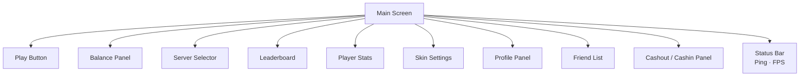
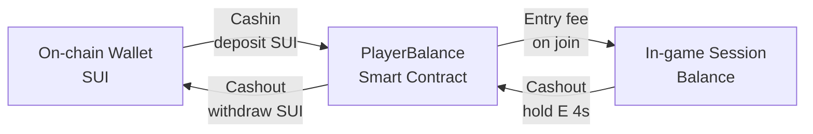

## Overview

The main interface is the primary screen players see when they are not inside an active arena. It provides access to every core function — joining a game, managing balance, viewing stats, customizing appearance, and interacting with the community.



---

## Play button

The Play button is the primary CTA on the main screen. Pressing it places the player into the next available arena in the selected region.

**What happens on click:**
1. The client checks that a wallet is connected and an entry fee is set
2. Sends `POST /join { region, wallet }` to the Private API
3. The server assigns the player to an arena and returns `arena_id` + `spawn_position`
4. The client transitions from the main screen to the in-game view and opens the WebSocket connection

<Warning>
  The Play button is disabled if no wallet is connected, if the player's balance is insufficient to cover the entry fee, or if the player is still within the 60-second death cooldown from a previous session.
</Warning>

---

## Balance panel

Displays the player's current on-chain wallet balance — the total SUI available for deposit and gameplay.

| Field | Description |
|---|---|
| **Wallet balance** | On-chain SUI balance, fetched live from the connected wallet |
| **In-game balance** | Accumulated `session_balance` from previous successful cashouts, held in the PlayerBalance smart contract |
| **Entry fee selector** | The amount staked per arena session — player sets this before joining |

The balance panel updates in real time whenever the player deposits (Cashin) or withdraws (Cashout).

---

## Server selector

Allows the player to choose which region their arena session will run in before pressing Play.

| Option | Identifier | Notes |
|---|---|---|
| Europe | `eu` | Recommended for players in Europe |
| North America | `us` | Recommended for players in the Americas |

The selected region is stored locally and persists between sessions. The Status bar shows the live ping to the selected region's server so the player can make an informed choice.

---

## Leaderboard

Displays the global all-time ranking of players by balance. Powered by `GET /leaderboard` from the Public API.

```typescript
GET /leaderboard?limit=100
```

| Column | Description |
|---|---|
| **Rank** | Global position by total balance |
| **Username** | Player display name |
| **Balance** | Lifetime balance accumulated |
| **Kills** | Total eliminations |

The leaderboard refreshes automatically every 30 seconds. Players can filter by `min_balance` to focus on top earners.

---

## Player stats

Shows the authenticated player's personal lifetime statistics, fetched from `GET /player/{wallet}`.

| Stat | Description |
|---|---|
| **Total balance** | Lifetime balance accumulated across all sessions |
| **Total kills** | Total eliminations |
| **Total deaths** | Total deaths |
| **Best length** | Longest snake length ever achieved |
| **Arenas joined** | Total number of arena sessions entered |
| **Win rate** | Ratio of sessions cashed out successfully vs. died |
| **Last played** | Timestamp of the most recent session |

Match history is accessible via `GET /player/{wallet}/history?limit=50` — up to 200 records per request.

---

## Skin settings

Allows the player to browse and equip available snake skins. The active skin is sent in every snapshot as `skin_id` and rendered by all clients in the arena.

**Skin panel features:**
- Browse owned skins
- Preview skin appearance before equipping
- Equip / unequip a skin (default skin always available)
- Future: Genesis NFT holders unlock exclusive skin variants

<Note>
  Skins are cosmetic only — they have no effect on gameplay, speed, or hitbox size.
</Note>

---

## Profile panel

Displays and allows editing of the player's public profile.

| Field | Editable | Description |
|---|---|---|
| **Username** | ✅ | In-game display name shown to other players |
| **Wallet address** | ❌ | Connected wallet — read only |
| **Referral link** | ✅ (copy) | Unique referral URL to share with others |
| **Avatar / skin preview** | ❌ | Reflects currently equipped skin |
| **Member since** | ❌ | Account creation date |

**Referral link** — each player has a unique referral URL. Copying it shares a pre-filled link that credits the player when a new user registers through it.

---

## Friend list

The friend list lets players track and interact with their connections directly from the main screen.

**Features:**
- View friends and their current online / in-game status
- See which arena a friend is in (region + arena ID)
- Add friends by wallet address or username
- Remove friends
- Spectate a friend's session (if they allow it)

---

## Cashout / Cashin panel

The financial panel for moving balance between the player's on-chain wallet and the in-game PlayerBalance smart contract.



### Cashin (deposit)

Transfers SUI from the player's connected wallet into the PlayerBalance smart contract, making it available as in-game balance.

```typescript
// Cashin flow
POST /cashin { wallet, amount }
// → smart contract deposit transaction
// → PlayerBalance increases
// → Balance panel updates
```

### Cashout (withdraw)

Transfers the player's full in-game balance from the PlayerBalance smart contract back to their on-chain wallet.

```typescript
// Cashout flow — triggered by holding E for 4 seconds in-game,
// or via the panel if not in an active session
POST /cashout { wallet }
// → exit_session() if in session
// → cash_out() smart contract transaction
// → On-chain wallet balance increases
// → In-game balance resets to 0
```

<Warning>
  Cashout from the panel is only available when the player is not in an active arena session and the 60-second death cooldown has passed. All gas fees are paid by the player.
</Warning>

---

## Status bar

A persistent overlay showing real-time connection quality. Always visible on the main screen and inside the arena.

| Indicator | Description |
|---|---|
| **Ping** | Round-trip latency to the selected region's game server in milliseconds |
| **FPS** | Client-side render frame rate |

See **Status** for full technical details on how ping and FPS are measured and displayed.

---

## Related pages

- **Status** — Ping and FPS measurement details.
- **Minimap** — The in-arena minimap overlay shown during a live session.
- **Skins** — Full skin system reference including ownership and equip logic.
- **Cashout System** — Player-facing documentation on the cashout flow and smart contract interaction.
- **Arenas** — How the Play button connects to arena assignment and the matchmaking flow.
- **WebSocket** — The connection opened when the player transitions from the main screen into a session.