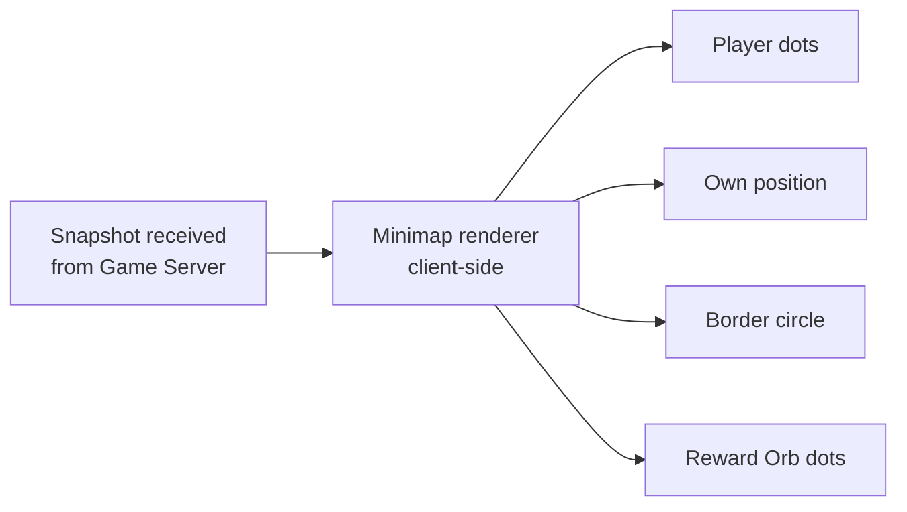
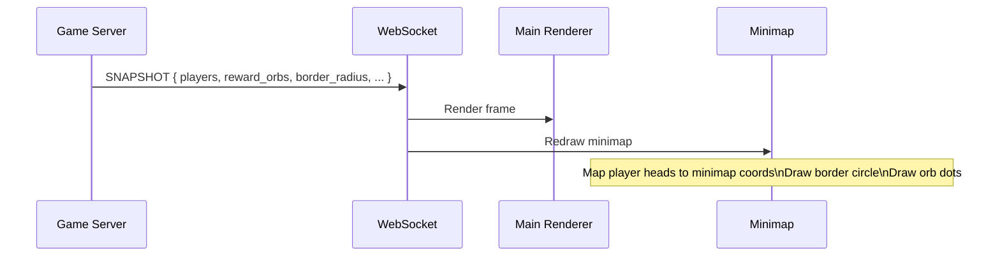

## Overview

The minimap is a small circular overlay rendered in the corner of the screen during an active arena session. It gives the player a bird's-eye view of the entire arena — their own position, all other players, the current border radius, and nearby Reward Orbs — without leaving the main game view.



<Note>
  The minimap is entirely client-side — it renders data received from the snapshot. It does not make separate network requests. Every update is driven by the next `SNAPSHOT` event arriving over WebSocket.
</Note>

---

## What the minimap shows

| Element | Representation | Notes |
|---|---|---|
| **Own snake** | Bright highlighted dot | Always centered or tracked — easiest to identify |
| **Other players** | Smaller colored dots | One dot per alive player, positioned at their head segment |
| **Border** | Circular outline | Reflects current `border_radius` from snapshot — animates as border changes |
| **Reward Orbs** | Small glowing dots | High-value orbs only — food items are not shown on the minimap |
| **Dead players** | Not shown | Removed from minimap on the tick they die |

---

## Coordinate mapping

The arena uses a Cartesian coordinate system centered at `(0, 0)`. The minimap maps this world space onto a fixed circular canvas in screen space.

```typescript
const MINIMAP_RADIUS_PX = 80; // minimap canvas radius in pixels

function worldToMinimap(
  worldX: number,
  worldY: number,
  borderRadius: number   // current arena border_radius from snapshot
): { x: number; y: number } {
  // Normalize world position to [-1, 1] relative to border radius
  const nx = worldX / borderRadius;
  const ny = worldY / borderRadius;

  // Scale to minimap pixel space
  return {
    x: nx * MINIMAP_RADIUS_PX,
    y: ny * MINIMAP_RADIUS_PX,
  };
}
```

As the arena border grows or shrinks, `borderRadius` changes — the minimap scale adjusts automatically so the border outline always fits the canvas exactly. Players near the edge of the arena appear near the edge of the minimap regardless of the current radius.

<Note>
  Positions outside the current border radius (body overhang) are clamped to the border circle edge on the minimap — they cannot appear outside the circular canvas.
</Note>

---

## Update rate

The minimap updates once per snapshot — the same rate as the main game renderer. There is no separate minimap tick or interpolation. Every `SNAPSHOT` event triggers a full minimap redraw.



---

## Border animation on the minimap

When the border radius changes (player joins or leaves), the snapshot `border_radius` and `border_target_radius` fields drive a smooth animation on the minimap border outline — matching the visual animation seen on the main game view.

```typescript
// Each render frame, animate minimap border toward target
currentMinimapBorder += (targetMinimapBorder - currentMinimapBorder) * LERP_FACTOR;

// border_target_radius from snapshot → targetMinimapBorder (scaled)
// border_radius from snapshot → currentMinimapBorder (actual server state)
```

The minimap border animates at the same perceived speed as the in-world border — expanding at 520 units/sec and shrinking at 380 units/sec — giving the player an early visual cue that the arena is changing size before it fully arrives on the main view.

---

## Danger warning

When the player's own snake head is within a threshold distance of the current border, the minimap border outline pulses red — mirroring the full-screen flashing red border warning shown in the main view.

```typescript
const distanceFromBorder = borderRadius - distanceFromOrigin(ownHead);

if (distanceFromBorder < BORDER_WARNING_THRESHOLD) {
  minimapBorderColor = "red";
  minimapBorderPulse = true;
} else {
  minimapBorderColor = "white";
  minimapBorderPulse = false;
}
```

<Warning>
  The minimap danger warning is a secondary indicator only. The primary warning is the full-screen flashing red border and audio cue. Players should not rely solely on the minimap when navigating near the border at high speed.
</Warning>

---

## What is not shown

| Element | Shown on minimap | Reason |
|---|---|---|
| Food items | ❌ | Too numerous — would clutter the minimap |
| Snake body segments | ❌ | Only head position is plotted per player |
| Boost state | ❌ | Visual-only in main view |
| Orbs below a value threshold | ❌ | Low-value orbs omitted to reduce noise |
| Dead players | ❌ | Removed on death tick |

---

## Related pages

- **Snapshots** — The data source for every minimap update — player positions, border radius, and orb locations.
- **Game World** — The coordinate system, border radius values, and border animation speeds the minimap visualizes.
- **Interface** — The main screen overlay context the minimap sits within.
- **Status** — The other persistent in-session overlay — ping and FPS display.