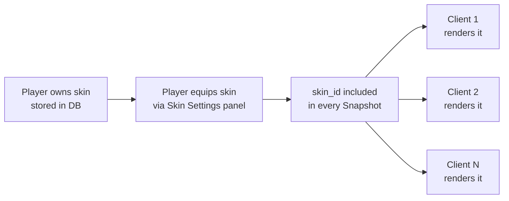
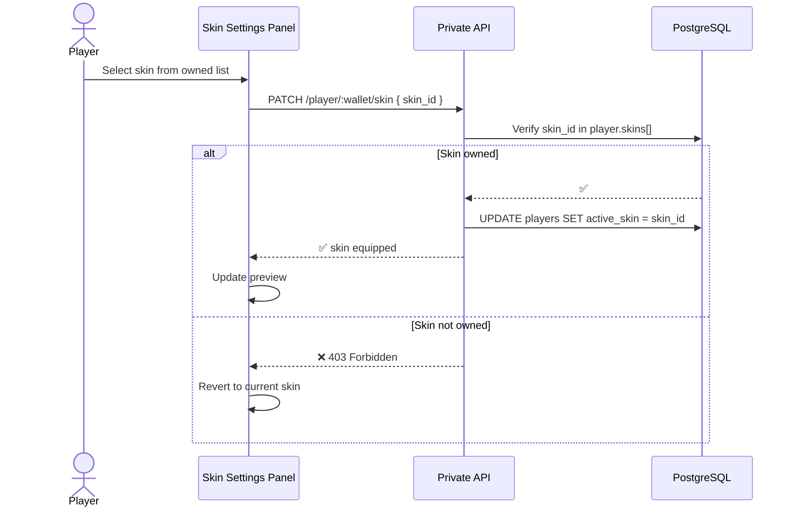
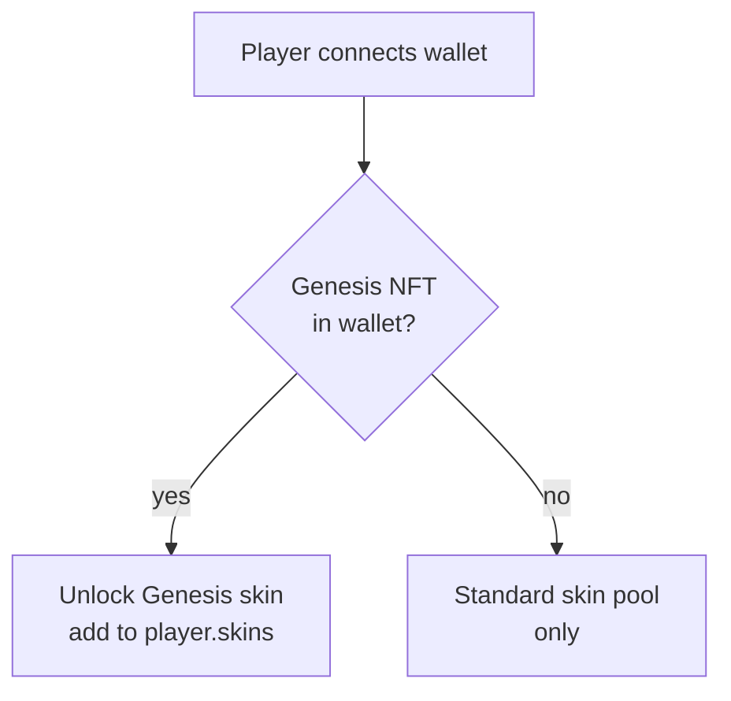

## Overview

Skins are cosmetic overlays applied to a player's snake. They are purely visual — no skin affects gameplay, speed, hitbox size, or any mechanical property. The active skin is stored on the player's profile, broadcast in every arena snapshot, and rendered by all clients in the session.



<Note>
  All clients in the arena render the skin of every player they can see — not just the local player. The `skin_id` field in each `PlayerSnapshot` is the single source of truth for what skin to render.
</Note>

---

## Skin types

| Type | How to obtain | Notes |
|---|---|---|
| **Default** | Available to all players | Always equipped if no other skin is active |
| **Standard** | Purchased or earned in-game | Available in the Skin Settings panel |
| **Genesis Exclusive** | Requires a Genesis NFT in connected wallet | Unlocked automatically on wallet verification |
| **Event** | Distributed during limited-time events | Time-limited, may not be re-obtainable |

<Note>
  Genesis Exclusive skins are verified at login — if the Genesis NFT is transferred out of the wallet, the exclusive skin is automatically unequipped on next login and reverts to the default.
</Note>

---

## Ownership

Owned skins are stored in the `skins` field of the `players` table as an array of `skin_id` strings.

```typescript
// players table — skins field
{
  "wallet_address": "0x742d...f44e",
  "skins": ["default", "skin_genesis_01", "skin_event_halloween"],
  "active_skin": "skin_genesis_01"
}
```

A player can only equip a skin that exists in their `skins` array. Attempting to equip an unowned skin is rejected by the server silently — the active skin reverts to default.

---

## Equipping a skin

The player selects and equips a skin from the **Skin Settings** panel on the main interface. The change takes effect immediately and persists across sessions.



```typescript
PATCH /player/:wallet/skin

{
  "skin_id": "skin_genesis_01"
}
```

---

## Rendering

The `skin_id` field in each `PlayerSnapshot` tells every client which skin to render for that player. A `null` value means the default skin is active.

```typescript
// From the Snapshot payload
{
  "wallet": "0x742d...f44e",
  "username": "SnekMaster",
  "is_alive": true,
  "segments": [[120, 340], [118, 337]],
  "skin_id": "skin_genesis_01",   // null = default
  ...
}
```

The client maps `skin_id` to a local asset — texture, color scheme, or shader — and applies it to the snake segments. Unknown `skin_id` values (e.g. from a client on an older version) fall back to the default skin renderer.

---

## Genesis NFT skins

Genesis Pass holders (555 total) get access to exclusive skin variants not available to the general player base.



**Unlock flow:**
1. Player connects their SUI wallet on login
2. The server verifies NFT ownership on-chain
3. If a Genesis Pass is detected, `skin_genesis_01` is added to `player.skins[]` automatically
4. The skin appears in the Skin Settings panel and can be equipped immediately

<Warning>
  Genesis skin access is tied to live wallet ownership — not a one-time grant. If the Genesis NFT is sold or transferred, the exclusive skin is revoked on the player's next login. The skin is re-granted automatically if the NFT is returned to the wallet.
</Warning>

---

## Future skin systems

The following skin-related features are planned for future updates and are not yet implemented:

| Feature | Description |
|---|---|
| **Loot Box skins** | Cosmetic items obtainable by opening Loot Boxes — Genesis NFT holders get better base rarity |
| **XP unlock skins** | Skins unlocked by reaching XP milestones through gameplay |
| **Seasonal / event skins** | Limited-time skins distributed during special in-game events |
| **Skin marketplace** | Player-to-player trading of owned cosmetic skins |

<Note>
  Full details on loot tables, XP rates, and skin rarity tiers will be added to the docs once these systems are implemented.
</Note>

---

## Database reference

Skins are stored directly on the player record — there is no separate skins table.

| Field | Type | Description |
|---|---|---|
| `skins` | `TEXT[]` | Array of owned `skin_id` strings |
| `active_skin` | `VARCHAR` | Currently equipped skin ID — `null` means default |

---

## Related pages

- **Interface** — The Skin Settings panel on the main screen where players browse and equip skins.
- **Snapshots** — How `skin_id` is included in every `PlayerSnapshot` and consumed by clients.
- **Genesis NFTs** — The Genesis Pass collection and the full list of holder benefits.
- **Death & Rewards** — Loot Boxes — the future system through which new skins can be obtained.
- **Tables & Relationships** — Full database schema including the `skins` and `boxes` fields on the players table.