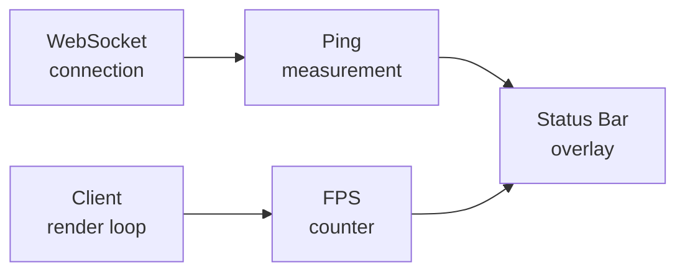
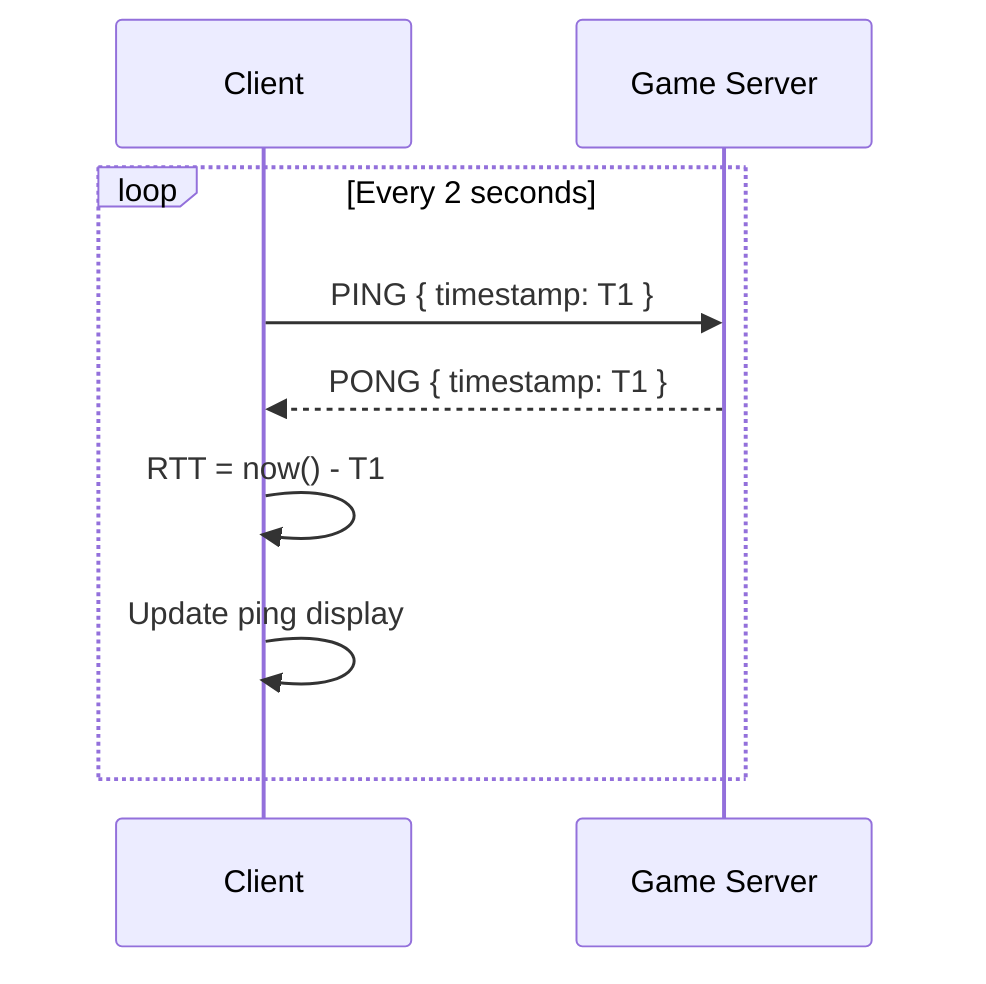
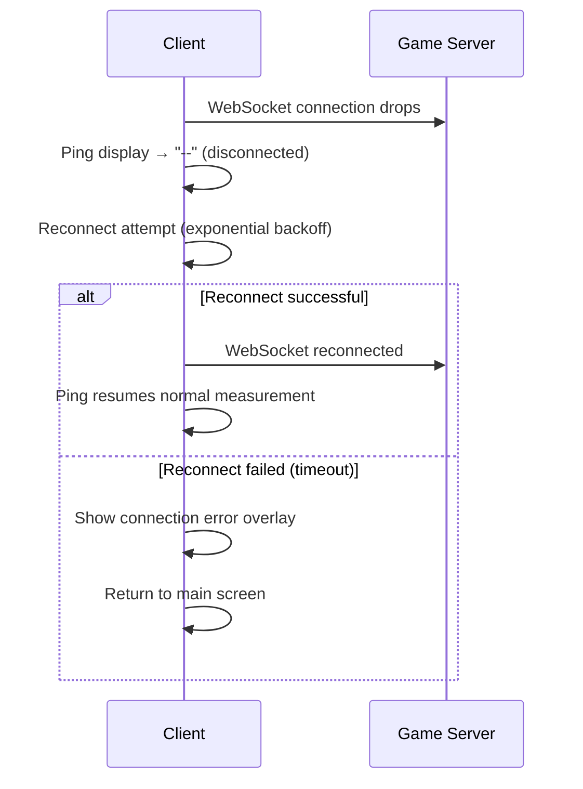

## Overview

The status bar is a lightweight persistent overlay that gives players real-time feedback on their connection quality and client performance. It is visible at all times — on the main screen and throughout an active arena session.



---

## Indicators

### Ping

Ping is the round-trip latency between the client and the game server in the selected region, measured in milliseconds.



The client sends a `PING` message over the WebSocket connection every 2 seconds and calculates round-trip time from the `PONG` response. The displayed value is a rolling average of the last 5 measurements to prevent jitter from causing rapid fluctuations.

| Range | Color | Status |
|---|---|---|
| 0 – 60 ms | 🟢 Green | Excellent |
| 61 – 120 ms | 🟡 Yellow | Good |
| 121 – 200 ms | 🟠 Orange | Degraded |
| 200+ ms | 🔴 Red | Poor |

<Note>
  Ping is measured to the game server of the currently selected region — EU or US. Switching regions in the server selector will cause the ping display to update within 2 seconds to reflect the new server's latency.
</Note>

<Warning>
  During an active arena session, a ping above 200ms may cause visible lag between input and snake movement, since all movement is server-authoritative. High ping does not affect balance or cashout safety — only the responsiveness of controls.
</Warning>

---

### FPS

FPS is the client-side render frame rate — how many frames per second the local machine is rendering. It is measured directly from the render loop using `requestAnimationFrame` timestamps.

```typescript
let lastFrame = performance.now();
let frameCount = 0;
let displayedFPS = 0;

function renderLoop(now: number) {
  frameCount++;
  const elapsed = now - lastFrame;

  // Update display every second
  if (elapsed >= 1000) {
    displayedFPS = Math.round((frameCount * 1000) / elapsed);
    frameCount = 0;
    lastFrame = now;
  }

  requestAnimationFrame(renderLoop);
}
```

| Range | Color | Status |
|---|---|---|
| 60+ fps | 🟢 Green | Smooth |
| 30 – 59 fps | 🟡 Yellow | Acceptable |
| Below 30 fps | 🔴 Red | Low — may affect playability |

<Note>
  FPS is a client-side metric only — it reflects local hardware performance, not server health. A low FPS does not affect other players or the server state in any way.
</Note>

---

## Display format

The status bar displays both values inline in the corner of the screen:

```
PING  42ms    FPS  87
```

On the main screen, ping reflects the latency to the selected region's server before a session starts. Inside an arena, ping reflects the active WebSocket connection to that session's game server.

---

## Disconnection handling

If the WebSocket connection drops, the ping indicator switches to a disconnected state while the client attempts to reconnect.



<Warning>
  If a disconnection occurs during an active arena session, the game server holds the player's session open for a short grace period. If the client reconnects within this window, the session resumes. If not, the session is closed without a death penalty and the entry fee is refunded.
</Warning>

---

## Related pages

- **Interface** — The main screen where the status bar is permanently visible.
- **WebSocket** — The connection layer that the ping measurement runs over.
- **Arenas** — Region selection and how it determines which server ping is measured against.