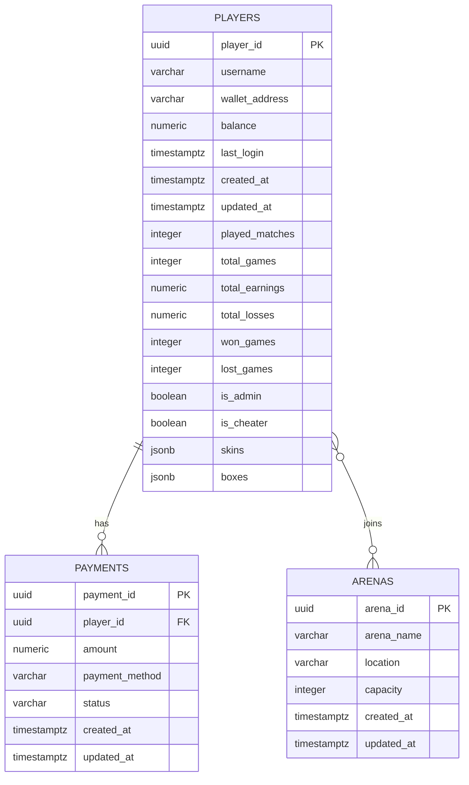

## Entity Relationship Diagram

---

## Players

Stores every registered player's identity, wallet, lifetime stats, and inventory.

<ResponseField name="player_id" type="UUID" required>
  Primary key — unique identifier for each player.
</ResponseField>

<ResponseField name="username" type="VARCHAR" required>
  Display name chosen by the player.
</ResponseField>

<ResponseField name="wallet_address" type="VARCHAR" required>
  Blockchain wallet address used for deposits and withdrawals.
</ResponseField>

<ResponseField name="balance" type="NUMERIC" required>
  Current in-game balance — earnable via Reward Orbs, withdrawable at any time.
</ResponseField>

<ResponseField name="last_login" type="TIMESTAMPTZ">
  Timestamp of the player's most recent session.
</ResponseField>

<ResponseField name="created_at" type="TIMESTAMPTZ" required>
  Account creation timestamp.
</ResponseField>

<ResponseField name="updated_at" type="TIMESTAMPTZ" required>
  Last record update timestamp.
</ResponseField>

<ResponseField name="played_matches" type="INTEGER">
  Total number of arena matches entered.
</ResponseField>

<ResponseField name="total_games" type="INTEGER">
  Total games played across all sessions.
</ResponseField>

<ResponseField name="total_earnings" type="NUMERIC">
  Cumulative earnings from Reward Orbs over all time.
</ResponseField>

<ResponseField name="total_losses" type="NUMERIC">
  Cumulative balance lost across all sessions. Use with `total_earnings` to calculate net profit.
</ResponseField>

<ResponseField name="won_games" type="INTEGER">
  Number of games won — survived or cashed out successfully.
</ResponseField>

<ResponseField name="lost_games" type="INTEGER">
  Number of games lost — eliminated before cashout.
</ResponseField>

<ResponseField name="is_admin" type="BOOLEAN">
  Whether the player has admin privileges.
</ResponseField>

<ResponseField name="is_cheater" type="BOOLEAN">
  Flag set by the system or admins when cheating is detected.
</ResponseField>

<ResponseField name="skins" type="JSONB">
  Array of owned snake skin IDs.
</ResponseField>

<ResponseField name="boxes" type="JSONB">
  Array of loot boxes owned or pending opening.
</ResponseField>

---

## Arenas

Stores the game arenas where matches take place.

<ResponseField name="arena_id" type="UUID" required>
  Primary key — unique identifier for the arena.
</ResponseField>

<ResponseField name="arena_name" type="VARCHAR" required>
  Human-readable name of the arena.
</ResponseField>

<ResponseField name="location" type="VARCHAR">
  Server region or physical location — e.g. `eu-west`, `us-east`.
</ResponseField>

<ResponseField name="capacity" type="INTEGER">
  Maximum number of concurrent players. Default: `40`. The circular arena border dynamically shrinks or expands based on current player count up to this limit.
</ResponseField>

<ResponseField name="created_at" type="TIMESTAMPTZ" required>
  Arena creation timestamp.
</ResponseField>

<ResponseField name="updated_at" type="TIMESTAMPTZ" required>
  Last record update timestamp.
</ResponseField>

---

## Payments

Logs every financial transaction tied to a player — deposits, withdrawals, and cashouts.

<ResponseField name="payment_id" type="UUID" required>
  Primary key — unique identifier for the transaction.
</ResponseField>

<ResponseField name="player_id" type="UUID" required>
  Foreign key → `PLAYERS.player_id`. Links the transaction to its owner.
</ResponseField>

<ResponseField name="amount" type="NUMERIC" required>
  Transaction amount. Positive = deposit, negative = withdrawal.
</ResponseField>

<ResponseField name="payment_method" type="VARCHAR">
  Method used: `wallet`, `stripe`, `crypto`, etc.
</ResponseField>

<ResponseField name="status" type="VARCHAR" required>
  One of: `pending` `completed` `failed` `refunded`

  <Warning>
    Never treat a payment as final until `status = 'completed'`. Always check `updated_at` for stale `pending` records — these may indicate a failed webhook or network timeout.
  </Warning>
</ResponseField>

<ResponseField name="created_at" type="TIMESTAMPTZ" required>
  When the transaction was initiated.
</ResponseField>

<ResponseField name="updated_at" type="TIMESTAMPTZ" required>
  Last status update timestamp.
</ResponseField>

---

## Relationships

<CardGroup cols={2}>
  <Card title="Players → Payments" icon="arrow-right">
    **One-to-Many.** A single player can have multiple payment records. Joined via `PAYMENTS.player_id → PLAYERS.player_id`.
  </Card>
  <Card title="Players ↔ Arenas" icon="arrows-left-right">
    **Many-to-Many.** Players join arenas per session. Currently tracked at the application layer — a dedicated `SESSIONS` table may be introduced in a future schema version.
  </Card>
</CardGroup>