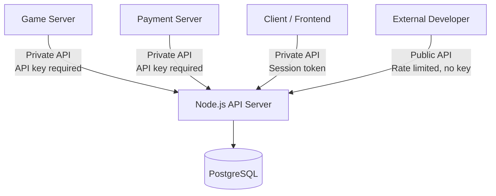
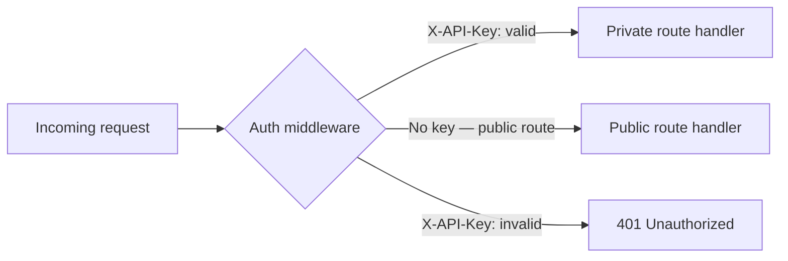
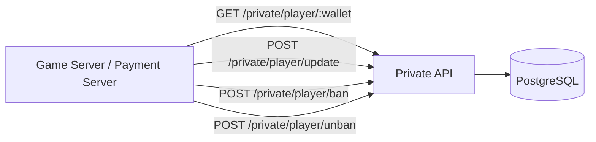
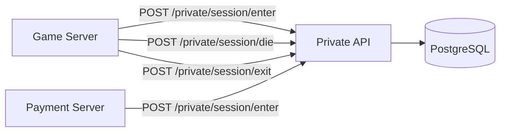
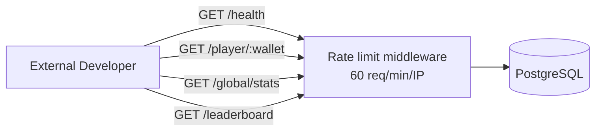

## Overview

The Serpentic API is a single Node.js + TypeScript server with two distinct layers: a **Private API** used internally by the Game Server and Payment Server, and a **Public API** open to developers. Both run on the same process and share the same PostgreSQL connection — the separation is enforced by authentication middleware.



<Info>
  The Private API is never exposed to the public internet directly. All private routes sit behind `X-API-Key` header authentication. The Public API is rate-limited to 60 requests per minute per IP and returns only read-only, non-sensitive data.
</Info>

---

## Authentication



```typescript
// middleware/auth.ts
export function requireApiKey(req: Request, res: Response, next: NextFunction) {
  const key = req.headers['x-api-key'];
  if (!key || key !== process.env.INTERNAL_API_KEY) {
    return res.status(401).json({ success: false, error: 'Unauthorized' });
  }
  next();
}

// Rate limiting for public routes
export const publicRateLimit = rateLimit({
  windowMs: 60 * 1000,
  max: 60,
  message: { success: false, error: 'Rate limit exceeded — max 60 req/min' },
});
```

---

## Private API

All private routes require the `X-API-Key` header. These are called only by the Game Server and Payment Server — never by the client or external developers.

### Player



| Method | Endpoint | Called by | Description |
|---|---|---|---|
| `GET` | `/private/player/:wallet` | Game Server, Payment Server | Full player record — state, balance, session, flags |
| `POST` | `/private/player/update` | Payment Server | Update balance, stats, session state |
| `POST` | `/private/player/ban` | Admin / Game Server | Set `is_cheater = true`, force-kick from arena |
| `POST` | `/private/player/unban` | Admin | Clear `is_cheater` flag |
| `DELETE` | `/private/player/:wallet/session` | Payment Server | Force-clear `active_session` (e.g. crash recovery) |

```typescript
// GET /private/player/:wallet
router.get('/player/:wallet', requireApiKey, async (req, res) => {
  const { wallet } = req.params;
  const player = await db.query(
    `SELECT * FROM players WHERE wallet_address = $1`,
    [wallet]
  );
  if (!player) return res.status(404).json({ success: false, error: 'Player not found' });
  res.json({ success: true, data: player });
});

// POST /private/player/update
router.post('/player/update', requireApiKey, async (req, res) => {
  const { wallet, fields } = req.body;
  // fields: { balance, active_session, is_alive, total_earnings, won_games, lost_games, ... }
  const sets   = Object.keys(fields).map((k, i) => `${k} = $${i + 2}`).join(', ');
  const values = [wallet, ...Object.values(fields)];
  await db.query(`UPDATE players SET ${sets} WHERE wallet_address = $1`, values);
  res.json({ success: true });
});
```

---

### Session



| Method | Endpoint | Called by | Description |
|---|---|---|---|
| `POST` | `/private/session/enter` | Game Server + Payment Server | Lock player into session, set `is_alive = true` |
| `POST` | `/private/session/die` | Game Server | Mark death, create orb rows |
| `POST` | `/private/session/exit` | Game Server | Clear session, allow cashout |
| `GET` | `/private/session/active` | Game Server | List all active sessions in a given arena |

```typescript
// POST /private/session/enter
router.post('/session/enter', requireApiKey, async (req, res) => {
  const { wallet, arena_id } = req.body;
  await db.query(`
    UPDATE players
    SET active_session = $1, is_alive = true
    WHERE wallet_address = $2 AND active_session IS NULL
  `, [arena_id, wallet]);
  res.json({ success: true });
});

// POST /private/session/die
router.post('/session/die', requireApiKey, async (req, res) => {
  const { wallet } = req.body;
  await db.query(`
    UPDATE players
    SET is_alive = false, last_death_timestamp = NOW()
    WHERE wallet_address = $1
  `, [wallet]);
  // Orb creation handled by Payment Server after this call
  res.json({ success: true });
});
```

---

### Orbs

| Method | Endpoint | Called by | Description |
|---|---|---|---|
| `POST` | `/private/orb/create` | Payment Server | Insert orb rows after player death |
| `POST` | `/private/orb/claim` | Payment Server | Mark orbs claimed, update claimer balance |
| `GET` | `/private/orb/active` | Game Server | Fetch all unclaimed orbs in an arena |

```typescript
// GET /private/orb/active?arena_id=...
router.get('/orb/active', requireApiKey, async (req, res) => {
  const { arena_id } = req.query;
  const orbs = await db.query(
    `SELECT o.* FROM orbs o
     JOIN players p ON p.wallet_address = o.dead_wallet
     WHERE p.active_session = $1 AND o.claimed = false`,
    [arena_id]
  );
  res.json({ success: true, data: orbs });
});
```

---

### Arena

| Method | Endpoint | Called by | Description |
|---|---|---|---|
| `GET` | `/private/arena/:id` | Game Server | Arena config — capacity, location, status |
| `POST` | `/private/arena/create` | Admin | Create a new arena record |
| `PATCH` | `/private/arena/:id` | Admin | Update capacity or location |
| `GET` | `/private/arena/:id/players` | Game Server | List all players currently in this arena |
| `POST` | `/private/arena/:id/stop` | Admin | Force-stop arena, kick all players |

---

### Admin

These endpoints correspond to the admin commands documented in [Admin Commands](/infrastructure-and-solutions/game-server/rendering/admin-commands).

| Method | Endpoint | Description |
|---|---|---|
| `POST` | `/private/admin/player/:wallet/kill` | Force-kill a player in-game |
| `POST` | `/private/admin/player/:wallet/kick` | Remove from arena without death penalty |
| `GET` | `/private/admin/arenas` | List all arenas with live player counts |
| `POST` | `/private/admin/arena/:id/restart` | Restart an arena instance |
| `POST` | `/private/admin/game/stop` | Global game stop |
| `POST` | `/private/admin/game/restart` | Global game restart |

---

## Public API

No API key required. Rate-limited to **60 requests per minute per IP**. All endpoints are read-only and return only non-sensitive aggregated data. This is the same API documented in the [Developer Integration](/developer-integration/quickstart) section.



| Method | Endpoint | Description |
|---|---|---|
| `GET` | `/health` | API health, version, uptime, online counts |
| `GET` | `/player/:wallet` | Player stats — kills, earnings, win rate, etc. |
| `GET` | `/player/:wallet/history` | Match history (max 200 records) |
| `GET` | `/global/stats` | Network-wide stats and totals |
| `GET` | `/leaderboard` | Global leaderboard (filterable, max 100) |

<Note>
  The Public API never exposes `wallet_address` in full in leaderboard responses — only the first and last 6 characters are shown (e.g. `0x742d...f44e`). Full wallet is only returned on direct `/player/:wallet` lookups where the caller already knows the address.
</Note>

### Response format

All endpoints — public and private — return the same JSON envelope:

```typescript
// Success
{
  "success": true,
  "data": { ... },
  "timestamp": "2026-05-23T12:00:00Z"
}

// Error
{
  "success": false,
  "error": "Human-readable error message",
  "code": "ERROR_CODE"       // e.g. RATE_LIMITED, NOT_FOUND, UNAUTHORIZED
}
```

---

## Private vs Public — comparison

| | Private API | Public API |
|---|---|---|
| Auth | `X-API-Key` header | None |
| Rate limit | None | 60 req/min/IP |
| Access | Game Server, Payment Server, Admin | Anyone |
| Operations | Read + Write | Read only |
| Data scope | Full player record, session state, orbs | Aggregated stats, public profile |
| Exposed to internet | No | Yes |

---

## Error codes

| Code | HTTP | Description |
|---|---|---|
| `UNAUTHORIZED` | 401 | Missing or invalid API key |
| `NOT_FOUND` | 404 | Player, arena, or orb not found |
| `ALREADY_IN_SESSION` | 409 | Player tried to enter while already in a session |
| `INSUFFICIENT_BALANCE` | 402 | Balance below entry fee |
| `DEAD_PLAYER` | 403 | Action not allowed while dead |
| `RATE_LIMITED` | 429 | Public API rate limit exceeded |
| `INTERNAL_ERROR` | 500 | Unexpected server error |