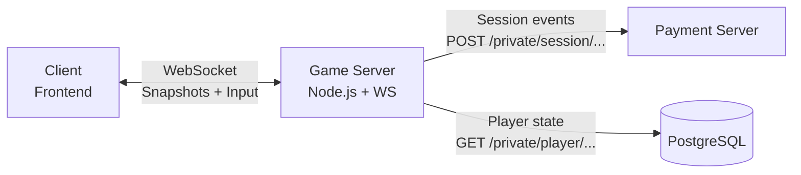
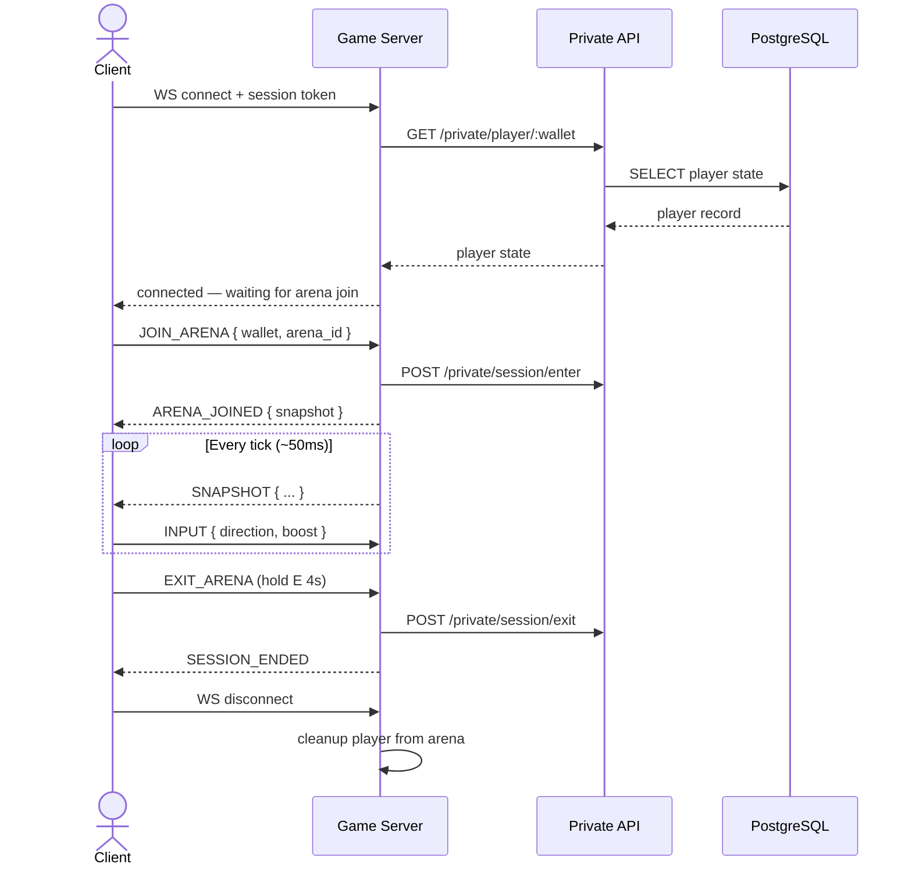
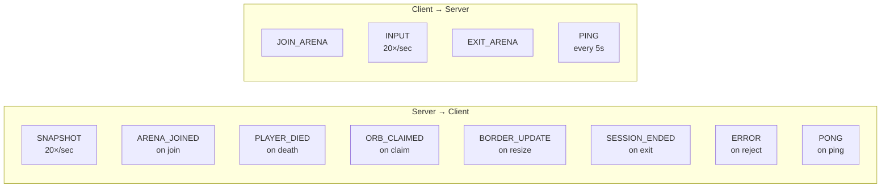

## Overview

The Game Server maintains a persistent WebSocket connection with every connected client. The server pushes **arena snapshots** at a fixed tick rate, and the client sends **input events** in return. All gameplay state flows through this channel — the REST API is only used for session management and economic events.



<Info>
  The WebSocket connection carries only gameplay data — positions, orbs, food, border radius, and events. Economic operations (deposit, cashout, orb claim) always go through the REST API, never through WebSocket.
</Info>

---

## Connection lifecycle



---

## Message format

Every message — both server-to-client and client-to-server — follows the same envelope:

```typescript
interface WsMessage {
  type: string;       // event type identifier
  payload: object;    // event-specific data
  ts: number;         // Unix timestamp ms (for latency tracking)
}
```

---

## Server → Client messages

### `SNAPSHOT`

Sent every tick (~50ms, 20 TPS). Contains the full current state of the arena. The client renders from this — no local simulation.

```typescript
interface Snapshot {
  type: 'SNAPSHOT';
  ts: number;
  payload: {
    tick: number;                  // monotonic tick counter
    border_radius: number;         // current arena border radius in units
    players: PlayerState[];        // all snakes in arena
    orbs: OrbState[];              // reward orbs on map
    food: FoodState[];             // food items on map
  };
}

interface PlayerState {
  wallet: string;                  // player identifier
  username: string;
  segments: [number, number][];    // [x, y] array — head first
  length: number;                  // current snake length
  boost_active: boolean;
  is_alive: boolean;
  balance: number;                 // current session balance (display only)
}

interface OrbState {
  orb_id: string;
  x: number;
  y: number;
  value: number;                   // USDC value of this orb
}

interface FoodState {
  food_id: string;
  x: number;
  y: number;
}
```

<Tip>
  The client should interpolate between snapshots for smooth rendering. With 20 TPS the tick interval is 50ms — linear interpolation between the last two snapshots is enough at 60fps.
</Tip>

---

### `ARENA_JOINED`

Sent once after a successful `JOIN_ARENA` request. Contains the initial full snapshot and arena metadata.

```typescript
interface ArenaJoined {
  type: 'ARENA_JOINED';
  payload: {
    arena_id: string;
    region: string;                // e.g. 'eu-west'
    capacity: number;              // max players (40)
    player_count: number;          // current player count
    snapshot: Snapshot['payload']; // initial state
  };
}
```

---

### `PLAYER_DIED`

Broadcast to all clients in the arena when a player dies. Triggers orb spawn animation on the client.

```typescript
interface PlayerDied {
  type: 'PLAYER_DIED';
  payload: {
    wallet: string;
    killer_wallet: string | null;  // null if border kill
    orbs_spawned: OrbState[];      // orbs dropped at death position
    position: [number, number];    // death position
  };
}
```

---

### `ORB_CLAIMED`

Broadcast when a player claims an orb. Client removes the orb from the map and shows a collect animation.

```typescript
interface OrbClaimed {
  type: 'ORB_CLAIMED';
  payload: {
    orb_id: string;
    claimed_by: string;            // wallet of the claimer
    value: number;
  };
}
```

---

### `BORDER_UPDATE`

Sent when the arena border changes size (player joins or leaves).

```typescript
interface BorderUpdate {
  type: 'BORDER_UPDATE';
  payload: {
    new_radius: number;
    previous_radius: number;
    direction: 'expanding' | 'shrinking';
    speed: number;                 // units/sec (expand: 520, shrink: 380)
    player_count: number;
  };
}
```

---

### `SESSION_ENDED`

Sent to the specific client after a successful `EXIT_ARENA`. Signals the client to show the cashout UI.

```typescript
interface SessionEnded {
  type: 'SESSION_ENDED';
  payload: {
    wallet: string;
    final_balance: number;
    session_duration_ms: number;
    orbs_collected: number;
    kills: number;
  };
}
```

---

### `ERROR`

Sent when the server rejects a client message.

```typescript
interface WsError {
  type: 'ERROR';
  payload: {
    code: string;     // e.g. ALREADY_IN_SESSION, INSUFFICIENT_BALANCE
    message: string;
  };
}
```

---

## Client → Server messages

### `JOIN_ARENA`

Sent after connection to request entering an arena. The server validates balance and session state via the Private API before confirming.

```typescript
interface JoinArena {
  type: 'JOIN_ARENA';
  payload: {
    wallet: string;
    arena_id: string;
  };
}
```

---

### `INPUT`

Sent continuously while in-game. The server processes these each tick to update snake direction.

```typescript
interface Input {
  type: 'INPUT';
  payload: {
    direction: number;    // angle in radians (0 = right, Math.PI/2 = down)
    boost: boolean;       // true while Space / Up Arrow / mouse button held
  };
}
```

<Note>
  Input messages are not acknowledged individually — the next `SNAPSHOT` reflects the processed result. The client should send inputs at the same rate as the tick (every ~50ms) to minimize perceived lag.
</Note>

---

### `EXIT_ARENA`

Sent after the player holds E for 4 seconds. The server calls `POST /private/session/exit` and responds with `SESSION_ENDED`.

```typescript
interface ExitArena {
  type: 'EXIT_ARENA';
  payload: {
    wallet: string;
  };
}
```

---

### `PING`

Sent by the client every 5 seconds to keep the connection alive and measure latency.

```typescript
interface Ping {
  type: 'PING';
  payload: { ts: number };
}
// Server responds with:
// { type: 'PONG', payload: { ts: number, server_ts: number } }
```

---

## Full message reference



---

## Tick rate & performance

| Parameter | Value |
|---|---|
| Tick rate | 20 TPS (50ms per tick) |
| Snapshot frequency | Every tick |
| Input sample rate | Every tick |
| Max players per arena | 40 |
| Ping interval | 5 seconds |
| Max snapshot size | ~8–12 KB at 40 players |
| Border expand speed | 520 units/sec |
| Border shrink speed | 380 units/sec |

<Warning>
  If a client does not send a `PING` for more than 15 seconds, the server closes the connection and clears the player's `active_session` in PostgreSQL via `DELETE /private/player/:wallet/session`. The player is removed from the arena without a death penalty.
</Warning>