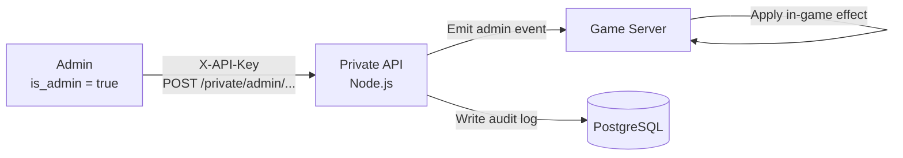
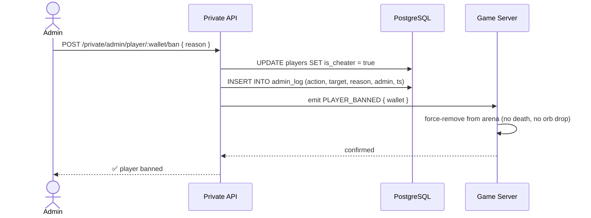
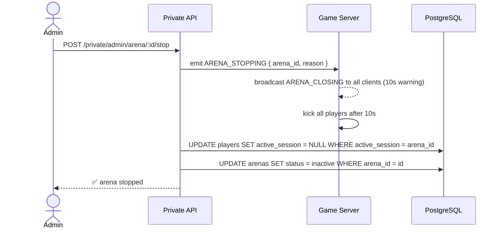
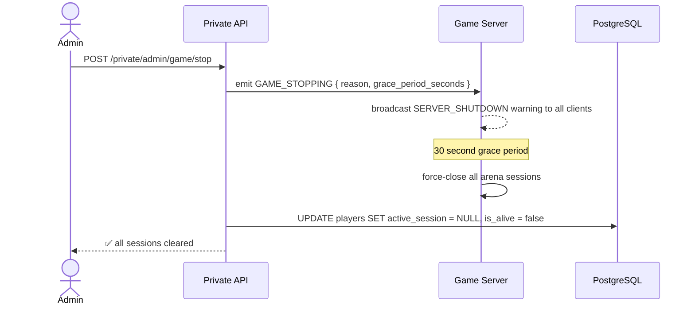

## Overview

Admin commands are privileged operations available only to players with `is_admin = true` in the database, or to internal services calling the Private API with a valid `X-API-Key`. All admin actions are logged to PostgreSQL with a timestamp, the issuing admin's wallet, and the affected target.



<Warning>
  All admin endpoints require the `X-API-Key` header. There is no in-game UI for admin commands — they are issued via the Private API only. Every action is permanently logged and cannot be undone except by a follow-up command.
</Warning>

---

## Player commands

### Ban player

Sets `is_cheater = true` in PostgreSQL and force-kicks the player from any active arena session without a death penalty.



**Request**
```typescript
POST /private/admin/player/:wallet/ban

{
  "reason": "speed hacking detected"
}
```

**What it does:**
- `is_cheater = true` in `players` table
- Clears `active_session` without triggering `die()` — no orb drop, no death cooldown
- Player cannot re-enter any arena while banned
- Emits `PLAYER_BANNED` WebSocket event to all clients in the arena (client shows ban notice)

---

### Unban player

Clears the `is_cheater` flag and restores arena access.

```typescript
POST /private/admin/player/:wallet/unban
```

**What it does:**
- `is_cheater = false` in `players` table
- Player can join arenas again immediately
- Logs unban action with admin wallet and timestamp

---

### View player stats

Returns the full player record from PostgreSQL — identical to `GET /private/player/:wallet` but routed through the admin namespace for audit logging.

```typescript
GET /private/admin/player/:wallet/stats
```

**Response**
```typescript
{
  "success": true,
  "data": {
    "wallet_address": "0x742d...f44e",
    "username": "SnekMaster",
    "balance": 45820.75,
    "total_games": 1247,
    "won_games": 839,
    "lost_games": 408,
    "total_earnings": 128450.00,
    "total_losses": 82630.25,
    "is_admin": false,
    "is_cheater": false,
    "active_session": null,
    "is_alive": false,
    "last_login": "2026-05-23T10:12:00Z",
    "created_at": "2025-11-04T08:00:00Z"
  }
}
```

---

### View player in-game state

Returns the player's live state directly from the Game Server — position, length, boost, current balance — rather than the database snapshot.

```typescript
GET /private/admin/player/:wallet/live
```

**Response**
```typescript
{
  "success": true,
  "data": {
    "wallet": "0x742d...f44e",
    "arena_id": "arena_eu_03",
    "is_alive": true,
    "segments": [[120, 340], [118, 338], "..."],
    "length": 412,
    "boost_active": false,
    "session_balance": 1.8,
    "session_duration_ms": 142000
  }
}
```

<Note>
  Returns `404` if the player is not currently in an active session. Use `GET /private/admin/player/:wallet/stats` for database state regardless of session.
</Note>

---

### Kill player in-game

Force-kills the player inside the arena. Triggers the full death flow — `die()` on the smart contract, orb creation, death cooldown.

```typescript
POST /private/admin/player/:wallet/kill

{
  "reason": "exploiting border collision"
}
```

**What it does:**
- Same as a natural death — `is_alive = false`, `last_death_timestamp = NOW()`
- Balance is split into orbs and dropped at current position
- 60-second cashout cooldown applies
- Broadcasts `PLAYER_DIED` to all clients in the arena
- Logs kill action with reason

---

### Kick player

Removes player from arena **without** triggering a death. No orb drop, no cooldown — player is simply disconnected from the session.

```typescript
POST /private/admin/player/:wallet/kick

{
  "reason": "AFK timeout override"
}
```

**What it does:**
- Clears `active_session` in PostgreSQL
- Does **not** call `die()` — balance stays intact
- Player can re-enter an arena immediately
- Broadcasts `PLAYER_KICKED` to the arena

---

### Promote / demote admin

Sets or clears the `is_admin` flag.

```typescript
POST /private/admin/player/:wallet/promote
POST /private/admin/player/:wallet/demote
```

<Warning>
  Only callable by admins whose own wallet is listed in `ADMIN_SEED_WALLETS` in the server environment. Prevents privilege escalation via a compromised admin account.
</Warning>

---

## Arena commands

### List all arenas

Returns all currently running arena instances with live player counts and border state.

```typescript
GET /private/admin/arenas
```

**Response**
```typescript
{
  "success": true,
  "data": [
    {
      "arena_id": "arena_eu_01",
      "region": "eu-west",
      "capacity": 40,
      "player_count": 27,
      "border_radius": 20200,
      "uptime_ms": 3420000,
      "status": "running"
    }
  ]
}
```

---

### View arena specs

Returns the full configuration and live state of a specific arena.

```typescript
GET /private/admin/arena/:id
```

---

### Update arena specs

Modifies arena configuration at runtime. Changes take effect on the next tick.

```typescript
PATCH /private/admin/arena/:id

{
  "capacity": 30,
  "location": "eu-central"
}
```

| Field | Type | Effect |
|---|---|---|
| `capacity` | `integer` | New max player count — existing players above the new cap are not kicked |
| `location` | `string` | Updates the region label in DB — does not migrate the server |

---

### List players in arena

Returns all players currently active in a given arena with their live state.

```typescript
GET /private/admin/arena/:id/players
```

**Response**
```typescript
{
  "success": true,
  "data": [
    {
      "wallet": "0x742d...f44e",
      "username": "SnekMaster",
      "is_alive": true,
      "length": 412,
      "session_balance": 1.8,
      "session_duration_ms": 142000
    }
  ]
}
```

---

### Spectate arena

Returns a continuous stream of arena snapshots for a given arena — identical to the player WebSocket `SNAPSHOT` payload but without joining. Useful for monitoring dashboards.

```typescript
GET /private/admin/arena/:id/spectate
// Returns: Server-Sent Events stream of Snapshot payloads
```

---

### Spectate player

Returns a continuous snapshot stream filtered to a specific player's viewport.

```typescript
GET /private/admin/player/:wallet/spectate
```

---

### Stop arena

Force-stops an arena instance. All players are kicked (no death, no orb drop), sessions are cleared in PostgreSQL, and the arena is marked `inactive`.

```typescript
POST /private/admin/arena/:id/stop

{
  "reason": "scheduled maintenance"
}
```



---

### Restart arena

Stops and immediately restarts an arena instance. Players are kicked and can rejoin the new instance.

```typescript
POST /private/admin/arena/:id/restart
```

---

## Game-wide commands

### Stop all games

Broadcasts a shutdown warning to every connected client, then force-closes all arena sessions after a 30-second grace period.

```typescript
POST /private/admin/game/stop

{
  "reason": "emergency maintenance",
  "grace_period_seconds": 30
}
```



---

### Restart all games

Stops all arenas then spins them back up. Useful for deploying a patch without a full server restart.

```typescript
POST /private/admin/game/restart

{
  "grace_period_seconds": 30
}
```

---

### Kill all players

Force-kills every alive player across all arenas simultaneously. All die naturally — orbs drop, cooldowns apply, stats update.

```typescript
POST /private/admin/game/killall

{
  "reason": "event reset"
}
```

<Warning>
  This triggers the full `die()` flow for every player at once — potentially hundreds of on-chain transactions in parallel. Use with caution on mainnet.
</Warning>

---

## Audit log

Every admin action writes a row to the `admin_log` table in PostgreSQL.

| Column | Type | Description |
|---|---|---|
| `log_id` | `UUID` | Primary key |
| `admin_wallet` | `VARCHAR` | Wallet of the admin who issued the command |
| `action` | `VARCHAR` | Command name — e.g. `BAN`, `KILL`, `ARENA_STOP` |
| `target_wallet` | `VARCHAR` | Affected player wallet (nullable for arena/game actions) |
| `target_arena` | `VARCHAR` | Affected arena ID (nullable for player actions) |
| `reason` | `TEXT` | Reason string from the request body |
| `created_at` | `TIMESTAMPTZ` | When the command was issued |

---

## Command reference

| Command | Endpoint | Scope |
|---|---|---|
| Ban player | `POST /private/admin/player/:wallet/ban` | Player |
| Unban player | `POST /private/admin/player/:wallet/unban` | Player |
| View player stats | `GET /private/admin/player/:wallet/stats` | Player |
| View player live state | `GET /private/admin/player/:wallet/live` | Player |
| Kill player | `POST /private/admin/player/:wallet/kill` | Player |
| Kick player | `POST /private/admin/player/:wallet/kick` | Player |
| Promote to admin | `POST /private/admin/player/:wallet/promote` | Player |
| Demote admin | `POST /private/admin/player/:wallet/demote` | Player |
| Spectate player | `GET /private/admin/player/:wallet/spectate` | Player |
| List all arenas | `GET /private/admin/arenas` | Arena |
| View arena specs | `GET /private/admin/arena/:id` | Arena |
| Update arena specs | `PATCH /private/admin/arena/:id` | Arena |
| List arena players | `GET /private/admin/arena/:id/players` | Arena |
| Spectate arena | `GET /private/admin/arena/:id/spectate` | Arena |
| Stop arena | `POST /private/admin/arena/:id/stop` | Arena |
| Restart arena | `POST /private/admin/arena/:id/restart` | Arena |
| Stop all games | `POST /private/admin/game/stop` | Global |
| Restart all games | `POST /private/admin/game/restart` | Global |
| Kill all players | `POST /private/admin/game/killall` | Global |