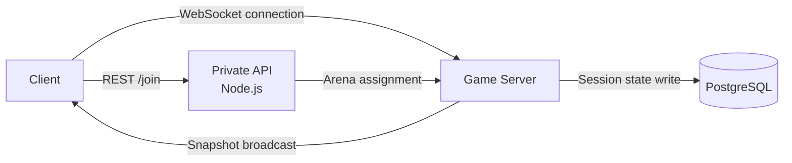
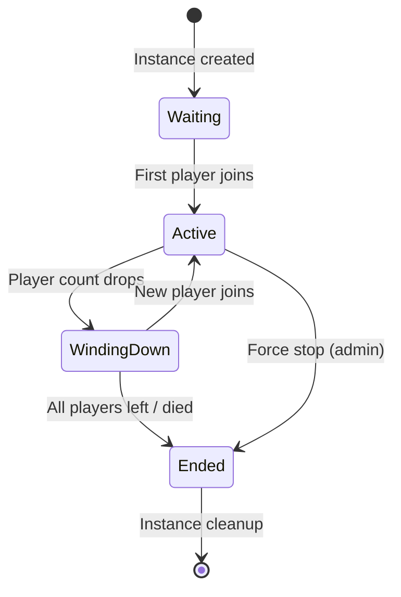
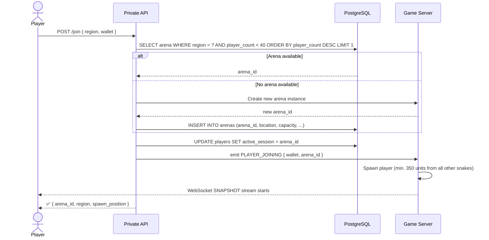
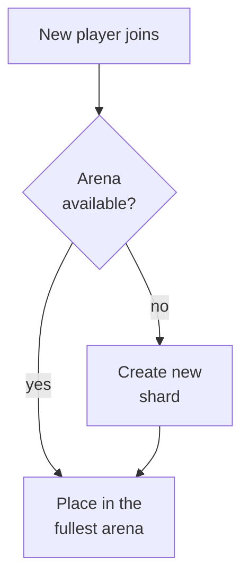

## Overview

Arenas are the core session management units of Serpentic. Each arena runs as an isolated game server instance with its own border state, player pool, and spawn logic. Arenas are fully independent from one another — no data flows between them in real time.



<Note>
  Every arena is hosted regionally — in either the EU or US region. The client selects a region from the main menu before joining. Matchmaking only operates within the selected region.
</Note>

---

## Regions

| Region | Identifier | Location |
|---|---|---|
| Europe | `eu` | EU server |
| North America | `us` | US server |

The region is stored in the `location` field of the `arenas` table. It can be modified at runtime via admin command, but this only updates the DB label — it does not migrate the server.

---

## Arena lifecycle

Every arena instance goes through the following lifecycle:



| Phase | Description |
|---|---|
| `Waiting` | Instance initialized. Border base size: 2400 units. Waiting for the first player. |
| `Active` | At least 1 player is active. Border scales dynamically with player count. |
| `WindingDown` | Player count is dropping. Border shrinks slowly (380 units/sec). |
| `Ended` | All players have died or exited. Instance shuts down, PostgreSQL cleanup runs. |

<Warning>
  If an arena is stopped via admin command (`POST /private/admin/arena/:id/stop`), it moves directly to `Ended` — all players are kicked without a death penalty after a 10-second grace period.
</Warning>

---

## Matchmaking and join flow

When a player wants to join an arena:



**Matchmaking rules:**
- The player is placed into the fullest arena that is not yet at capacity (dense session priority)
- Manual arena selection is not possible
- Spawn position: minimum 350 units from every other snake
- Entry fee must be paid before joining — the session only starts after a successful transaction

---

## Sharding

Serpentic handles any number of concurrent players through automatic sharding:



- Max **40 players** per arena instance
- When all active arenas are full, the game server immediately opens a new shard
- No cross-shard communication — border, orbs, and food are fully isolated per arena
- No global player cap — scales horizontally
- Players cannot switch arenas mid-session

---

## Arena state on the Game Server

The game server keeps the following state in memory for every active arena:

```typescript
interface ArenaState {
  arena_id: string;               // e.g. "arena_eu_03"
  region: "eu" | "us";
  player_count: number;           // 0–40
  border_radius: number;          // current radius in units
  border_target_radius: number;
  status: "waiting" | "active" | "winding_down" | "ended";
  players: Map<string, PlayerState>;
  food: FoodItem[];
  reward_orbs: RewardOrb[];
  created_at: number;             // Unix timestamp
}
```

This state is updated every tick and sent to clients as a snapshot over WebSocket. Only session-critical fields are written to PostgreSQL (`active_session`, `is_alive`, `balance`) — the full arena state lives exclusively in memory.

<Note>
  If the game server crashes, the in-memory arena state is lost. PostgreSQL can recover who was in an active session, but positions, snake lengths, and orb locations cannot be restored. Crashed sessions are therefore automatically closed without a death penalty — entry fees are refunded to affected players.
</Note>

---

## ARENAS table

```sql
CREATE TABLE arenas (
  arena_id    VARCHAR PRIMARY KEY,   -- e.g. "arena_eu_03"
  arena_name  VARCHAR,
  location    VARCHAR,               -- "eu" | "us"
  capacity    INTEGER DEFAULT 40,
  status      VARCHAR DEFAULT 'waiting',
  created_at  TIMESTAMPTZ DEFAULT NOW(),
  updated_at  TIMESTAMPTZ DEFAULT NOW()
);
```

| Field | Type | Description |
|---|---|---|
| `arena_id` | `VARCHAR` | Unique instance identifier |
| `arena_name` | `VARCHAR` | Human-readable name (e.g. `EU Arena 3`) |
| `location` | `VARCHAR` | Region — `eu` or `us` |
| `capacity` | `INTEGER` | Max player count (default: 40) |
| `status` | `VARCHAR` | Current lifecycle phase |
| `created_at` | `TIMESTAMPTZ` | Timestamp when the instance was created |
| `updated_at` | `TIMESTAMPTZ` | Timestamp of the last update |

---

## Related pages

- **Snapshots** — How arena state is serialized and sent to clients as JSON snapshots over WebSocket.
- **Input Processing** — How player inputs are processed and snakes are rendered each tick.
- **WebSocket** — The client–server connection and snapshot stream in detail.
- **Admin Commands** — Listing, spectating, stopping arenas, and modifying specs at runtime.
- **Tables & Relationships** — The full database schema, including the `arenas` table.