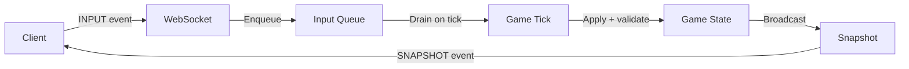
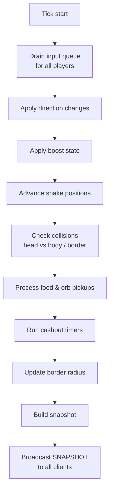
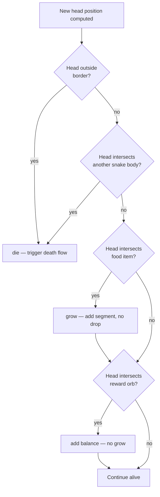
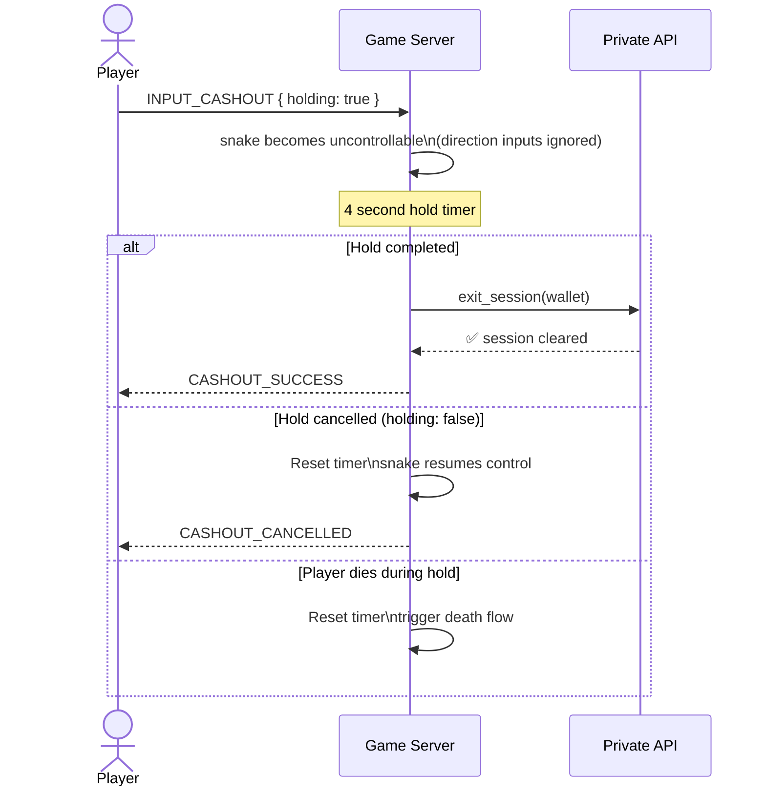

## Overview

Input processing is the pipeline that takes raw player inputs from the WebSocket connection and translates them into game state changes on the server. Every tick, the server processes all queued inputs, updates snake positions and states, checks for collisions, and emits a new snapshot to all clients.



<Note>
  The server is authoritative at all times. The client never moves snakes locally — it only renders the state it receives via snapshots. All movement, collision, and boost logic runs exclusively on the Game Server.
</Note>

---

## Input types

The client can send three types of inputs over the WebSocket connection:

| Input | Event | Payload | Description |
|---|---|---|---|
| Direction change | `INPUT_DIRECTION` | `{ angle: number }` | New heading angle in radians (0 – 2π) |
| Boost | `INPUT_BOOST` | `{ active: boolean }` | Start or stop boosting |
| Cashout hold | `INPUT_CASHOUT` | `{ holding: boolean }` | Begin or cancel the 4-second cashout hold |

```typescript
// Direction change
{ type: "INPUT_DIRECTION", angle: 1.5708 }

// Boost toggle
{ type: "INPUT_BOOST", active: true }

// Cashout hold
{ type: "INPUT_CASHOUT", holding: true }
```

---

## Tick loop

The game server runs a fixed-rate tick loop. Every tick:



<Note>
  Inputs that arrive between ticks are queued and applied at the start of the next tick. Only the most recent `INPUT_DIRECTION` per player per tick is applied — rapid direction spam is collapsed to the last value.
</Note>

---

## Direction and movement

Snakes move forward automatically every tick. The client only controls the heading angle — the server computes the new head position based on the current angle and the snake's speed.

```typescript
// Per tick, for each alive snake
const speed = player.boost_active ? BOOST_SPEED : BASE_SPEED;
const newHead = {
  x: currentHead.x + Math.cos(player.angle) * speed,
  y: currentHead.y + Math.sin(player.angle) * speed,
};

// Push new head, drop last segment (unless growing)
snake.segments.unshift(newHead);
if (!snake.growing) {
  snake.segments.pop();
}
```

**Speed values:**

| State | Speed |
|---|---|
| Normal | `BASE_SPEED` units/tick |
| Boosting | `BOOST_SPEED` units/tick |

The longer the snake, the same speed applies — but longer snakes are harder to turn quickly due to their larger hitbox footprint.

---

## Boost

Boost is activated by holding `Space`, `↑`, or any mouse button. The server tracks boost state per player and applies it during position advancement each tick.

```typescript
if (input.type === "INPUT_BOOST") {
  player.boost_active = input.active && player.boost_energy > 0;
}

// Each tick while boosting
if (player.boost_active) {
  player.boost_energy -= BOOST_DRAIN_PER_TICK;
  if (player.boost_energy <= 0) {
    player.boost_energy = 0;
    player.boost_active = false;
  }
}

// Boost energy regenerates while not boosting
if (!player.boost_active && player.boost_energy < MAX_BOOST_ENERGY) {
  player.boost_energy += BOOST_REGEN_PER_TICK;
}
```

<Warning>
  Boost state is fully server-authoritative. If a client sends `INPUT_BOOST: true` but the player has 0 boost energy, the server ignores it and keeps `boost_active = false`. The client's boost bar is a visual mirror of the server's `boost_energy` value received via snapshot.
</Warning>

---

## Collision detection

Collision checks run every tick after position advancement, in this order:



**Border collision** — The head position is checked against the current border radius. If `distance(head, origin) >= border_radius`, the player dies instantly.

**Body collision** — The new head position is checked against every segment of every other alive snake. If the distance between the head and any segment center is below the collision threshold, the player dies.

**Food pickup** — If the head is within pickup radius of a food item, the food is consumed: the snake gains a growth segment and the food is removed from the arena.

**Orb pickup** — If the head is within pickup radius of a Reward Orb, the orb is consumed: the player's `session_balance` increases by the orb's value and the orb is removed.

---

## Cashout hold

The cashout flow begins when the client sends `INPUT_CASHOUT: { holding: true }`. The server starts a 4-second server-side timer for that player.



**Rules during cashout hold:**
- All `INPUT_DIRECTION` and `INPUT_BOOST` events are ignored — the snake moves straight and uncontrolled
- If the player dies during the hold (collision), the cashout is cancelled and normal death flow runs
- The 60-second death cooldown must have passed before the hold can begin
- The player must not be in an active arena session — the hold only works after exiting

---

## Input validation

Every input is validated before being applied. Invalid inputs are silently dropped — no error is sent to the client.

| Check | Rule |
|---|---|
| Player is alive | Dead players' inputs are ignored |
| Player is in session | Inputs from players without `active_session` are ignored |
| Angle range | `INPUT_DIRECTION` angle must be in `[0, 2π]` — clamped if outside |
| Boost energy | `INPUT_BOOST: true` ignored if `boost_energy === 0` |
| Cashout eligibility | `INPUT_CASHOUT` ignored if death cooldown has not passed |

---

## Related pages

- **Snapshots** — How the processed game state is serialized and broadcast to clients after each tick.
- **WebSocket** — The connection layer that carries input events from client to server and snapshots back.
- **Arenas** — The arena instance lifecycle and how the tick loop is scoped per arena.
- **Controls** — Player-facing documentation on keybinds and input methods.
- **Admin Commands** — Force-kill and kick commands that bypass the normal input pipeline.