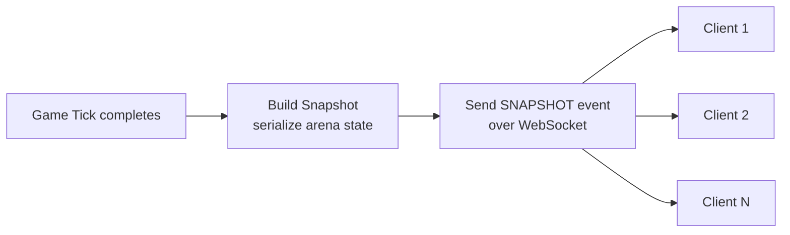
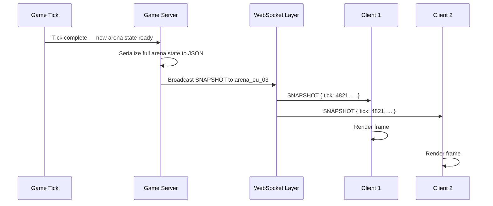

## Overview

After every tick, the Game Server builds a complete snapshot of the arena state and broadcasts it to every connected client in that arena over WebSocket. The client is stateless — it never simulates movement locally. It only renders what it receives.



<Note>
  Every client in an arena receives the same full snapshot — there is no per-client viewport culling on the server. The client is responsible for deciding what to render based on the player's current position.
</Note>

---

## Snapshot structure

Snapshots are sent as JSON over the WebSocket connection. The top-level envelope wraps the full arena state at the moment of serialization.

```typescript
interface Snapshot {
  type: "SNAPSHOT";
  tick: number;                    // monotonically increasing tick counter
  timestamp: number;               // Unix ms — server time at tick end
  arena_id: string;                // e.g. "arena_eu_03"
  border_radius: number;           // current border radius in units
  border_target_radius: number;    // radius the border is animating toward
  players: PlayerSnapshot[];
  food: FoodSnapshot[];
  reward_orbs: OrbSnapshot[];
  events: GameEvent[];             // deaths, pickups, etc. that occurred this tick
}
```

---

## Player snapshot

Each alive and recently dead player is included in the `players` array.

```typescript
interface PlayerSnapshot {
  wallet: string;                  // player identifier
  username: string;
  is_alive: boolean;
  segments: [number, number][];    // ordered head → tail, [x, y] pairs
  length: number;                  // total segment count
  angle: number;                   // current heading in radians
  boost_active: boolean;
  boost_energy: number;            // 0–100
  session_balance: number;         // balance earned this session
  skin_id: string | null;          // active skin, null = default
}
```

<Note>
  Dead players are included in the snapshot for one tick after death — with `is_alive: false` and an empty `segments` array — so the client can play the death animation. They are omitted from subsequent snapshots.
</Note>

---

## Food snapshot

```typescript
interface FoodSnapshot {
  id: string;                      // unique food item ID
  x: number;
  y: number;
}
```

Food items are small and numerous — the server sends only items currently inside the border radius. Items outside the border are deleted and never appear in snapshots.

---

## Reward orb snapshot

```typescript
interface OrbSnapshot {
  id: string;                      // unique orb ID
  x: number;
  y: number;
  value: number;                   // balance reward on pickup
}
```

---

## Events

The `events` array contains discrete things that happened during the tick — deaths, pickups, border changes. The client uses these to trigger animations and sound effects without having to diff the state itself.

```typescript
type GameEvent =
  | { type: "PLAYER_DIED";    wallet: string; killer_wallet: string | null; orbs_dropped: number }
  | { type: "PLAYER_JOINED";  wallet: string; username: string }
  | { type: "PLAYER_LEFT";    wallet: string }
  | { type: "ORB_PICKED_UP";  orb_id: string; wallet: string; value: number }
  | { type: "FOOD_EATEN";     food_id: string; wallet: string }
  | { type: "BORDER_CHANGED"; old_radius: number; new_radius: number }
  | { type: "PLAYER_BANNED";  wallet: string }
  | { type: "PLAYER_KICKED";  wallet: string }
  | { type: "ARENA_CLOSING";  reason: string; grace_period_seconds: number };
```

**Event notes:**

| Event | When it fires | Client use |
|---|---|---|
| `PLAYER_DIED` | Head collision with body or border | Death animation, orb spawn effect |
| `PLAYER_JOINED` | New player spawns in arena | Join notification |
| `PLAYER_LEFT` | Player exited safely (cashout) | Leave notification |
| `ORB_PICKED_UP` | Orb consumed by a player | Balance flash, orb disappear effect |
| `FOOD_EATEN` | Food consumed by a player | Growth animation |
| `BORDER_CHANGED` | Border radius target changes | Border animation trigger |
| `PLAYER_BANNED` | Admin bans a player mid-session | Ban notice shown to all clients |
| `PLAYER_KICKED` | Admin kicks a player | Kick notice |
| `ARENA_CLOSING` | Admin stops the arena | Countdown warning shown to all clients |

---

## Full snapshot example

```json
{
  "type": "SNAPSHOT",
  "tick": 4821,
  "timestamp": 1748000000000,
  "arena_id": "arena_eu_03",
  "border_radius": 18640,
  "border_target_radius": 19320,
  "players": [
    {
      "wallet": "0x742d...f44e",
      "username": "SnekMaster",
      "is_alive": true,
      "segments": [[120, 340], [118, 337], [115, 333]],
      "length": 3,
      "angle": 1.5708,
      "boost_active": false,
      "boost_energy": 82,
      "session_balance": 1.45,
      "skin_id": null
    }
  ],
  "food": [
    { "id": "food_001", "x": 540, "y": -210 },
    { "id": "food_002", "x": -330, "y": 80 }
  ],
  "reward_orbs": [
    { "id": "orb_007", "x": 200, "y": 150, "value": 0.25 }
  ],
  "events": [
    {
      "type": "FOOD_EATEN",
      "food_id": "food_001",
      "wallet": "0x742d...f44e"
    }
  ]
}
```

---

## Broadcast flow



<Warning>
  Snapshots are fire-and-forget — the server does not wait for client acknowledgement. If a client misses a tick (network lag, dropped packet), it simply renders the next snapshot it receives. There is no snapshot replay or delta recovery mechanism.
</Warning>

---

## Spectate snapshots

Admin spectate endpoints (`GET /private/admin/arena/:id/spectate` and `GET /private/admin/player/:wallet/spectate`) stream the same `SNAPSHOT` payload as a Server-Sent Events feed — identical structure, no special fields. The player-scoped endpoint returns the full arena snapshot, not a cropped viewport.

---

## Related pages

- **WebSocket** — The connection layer that carries snapshot events from server to client.
- **Input Processing** — The tick pipeline that produces the state serialized into each snapshot.
- **Arenas** — Arena instance lifecycle and how the snapshot broadcast is scoped per arena.
- **Admin Commands** — Spectate endpoints that consume the snapshot stream outside a player session.