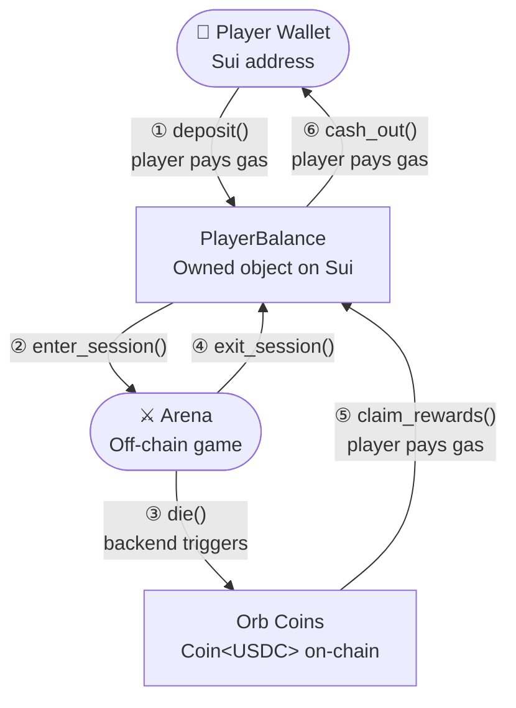

## Overview

Serpentic's economy runs on **Sui Move smart contracts**. Every player's funds live in their own `PlayerBalance` owned object — the backend never holds or controls player money. All gas fees are paid by the player.



<Info>
  The `PlayerBalance` object is always owned by the player's wallet — not by the game contract or the backend. The backend only validates and triggers transactions; it never pays gas.
</Info>

---

## PlayerBalance Object

The core data structure. Every player has one, created on their first deposit.

```move
struct PlayerBalance<phantom T> has key {
    id: UID,
    owner: address,
    balance: Balance<T>,           // USDC or any supported coin
    active_session: Option<ID>,    // current arena session ID (None if not in game)
    is_alive: bool,                // alive status within the current session
    last_death_timestamp: u64,     // Unix timestamp in seconds
}
```

| Field | Type | Description |
|---|---|---|
| `id` | `UID` | Unique Sui object ID |
| `owner` | `address` | Player's wallet address — only they can interact |
| `balance` | `Balance<T>` | Current funds (USDC) held in the object |
| `active_session` | `Option<ID>` | Set when inside an arena, cleared on exit |
| `is_alive` | `bool` | Whether the player is alive in the current session |
| `last_death_timestamp` | `u64` | Used to enforce the 60-second death cooldown |

---

## Constants & Error Codes

```move
// Timing
const DEATH_COOLDOWN_SECONDS: u64 = 60;
const MIN_ENTRY_AMOUNT: u64 = 500_000_000; // 0.5 USDC (6 decimals)

// Errors
const ENotOwner: u64 = 1;
const EInsufficientBalance: u64 = 2;
const EStillInGame: u64 = 3;
const ERecentlyDied: u64 = 4;
const EInvalidSession: u64 = 5;
```

---

## Functions

### `create_and_deposit`

Called when a player deposits funds for the first time. Creates their `PlayerBalance` object and transfers it to their wallet.

```move
public entry fun create_and_deposit<T>(
    coin: Coin<T>,
    ctx: &mut TxContext
) {
    let amount = coin::value(&coin);
    assert!(amount >= MIN_ENTRY_AMOUNT, EInsufficientBalance);

    let balance_obj = PlayerBalance<T> {
        id: object::new(ctx),
        owner: tx_context::sender(ctx),
        balance: coin::into_balance(coin),
        active_session: option::none(),
        is_alive: false,
        last_death_timestamp: 0,
    };

    transfer::transfer(balance_obj, tx_context::sender(ctx));
}
```

<Note>
  Minimum entry is **0.5 USDC**. If the player already has a `PlayerBalance` object, they can deposit directly into it instead of calling this function again.
</Note>

---

### `enter_session`

Called when the player enters an arena. Locks the balance to the session — cashout is blocked until they exit.

```move
public entry fun enter_session<T>(
    self: &mut PlayerBalance<T>,
    session_id: ID,
    ctx: &mut TxContext
) {
    assert!(self.owner == tx_context::sender(ctx), ENotOwner);
    assert!(option::is_none(&self.active_session), EStillInGame);

    self.active_session = option::some(session_id);
    self.is_alive = true;
}
```

<Warning>
  A player cannot enter a new session while `active_session` is set. They must exit first.
</Warning>

---

### `die`

Called by the backend when the player dies in-game. Records the death timestamp, which starts the 60-second cooldown.

```move
public entry fun die<T>(
    self: &mut PlayerBalance<T>,
    clock: &Clock,
    ctx: &mut TxContext
) {
    assert!(self.owner == tx_context::sender(ctx), ENotOwner);
    assert!(option::is_some(&self.active_session), EInvalidSession);

    self.is_alive = false;
    self.last_death_timestamp = clock::timestamp_ms(clock) / 1000;
}
```

<Note>
  When a player dies, the backend splits their remaining balance into `Coin<USDC>` orb objects. These are tracked off-chain by position and become claimable by other players.
</Note>

---

### `claim_rewards`

Called when a player collects an orb dropped by a dead player. The orb's `Coin` is merged directly into their `PlayerBalance`.

```move
public entry fun claim_rewards<T>(
    self: &mut PlayerBalance<T>,
    orb_coin: Coin<T>,
    ctx: &mut TxContext
) {
    assert!(self.owner == tx_context::sender(ctx), ENotOwner);

    balance::join(&mut self.balance, coin::into_balance(orb_coin));
}
```

<Tip>
  Claims can be batched — multiple orbs can be merged in a single transaction to save gas.
</Tip>

---

### `exit_session`

Called after a successful cashout hold (E key, 4 seconds). Clears the `active_session` lock so cashout becomes available.

```move
public entry fun exit_session<T>(
    self: &mut PlayerBalance<T>,
    ctx: &mut TxContext
) {
    assert!(self.owner == tx_context::sender(ctx), ENotOwner);
    assert!(option::is_some(&self.active_session), EInvalidSession);

    self.active_session = option::none();
}
```

---

### `cash_out`

The final step. Transfers the requested amount from `PlayerBalance` back to the player's wallet. Requires no active session and — if the player died — a 60-second cooldown.

```move
public entry fun cash_out<T>(
    self: &mut PlayerBalance<T>,
    amount: u64,
    clock: &Clock,
    ctx: &mut TxContext
) {
    let sender = tx_context::sender(ctx);
    assert!(self.owner == sender, ENotOwner);
    assert!(option::is_none(&self.active_session), EStillInGame);

    let now = clock::timestamp_ms(clock) / 1000;
    if (self.last_death_timestamp > 0) {
        assert!(
            now - self.last_death_timestamp >= DEATH_COOLDOWN_SECONDS,
            ERecentlyDied
        );
    };

    assert!(balance::value(&self.balance) >= amount, EInsufficientBalance);

    let out_coin = coin::from_balance(
        balance::split(&mut self.balance, amount),
        ctx
    );
    transfer::public_transfer(out_coin, sender);
}
```

---

## Full Transaction Flow

| Step | Function | Who calls it | Gas paid by |
|---|---|---|---|
| First deposit | `create_and_deposit` | Player | Player |
| Enter arena | `enter_session` | Player | Player |
| Collect orb | `claim_rewards` | Player | Player |
| Die in arena | `die` | Backend (on behalf) | Player |
| Hold E to exit | `exit_session` | Player | Player |
| Withdraw funds | `cash_out` | Player | Player |

<Info>
  The backend **never pays gas**. It validates state and can trigger `die()` on behalf of the player, but all economic transactions are signed and paid by the player's wallet.
</Info>

---

## Cashout Guard Logic

The contract enforces three conditions before allowing a cashout:

<CardGroup cols={3}>
  <Card title="No Active Session" icon="door-open">
    `active_session` must be `None`. A player inside an arena cannot cashout — they must exit first via the E key.
  </Card>
  <Card title="Death Cooldown" icon="clock">
    If the player died, `last_death_timestamp` must be at least **60 seconds** in the past. Prevents instant cashout exploits after dying.
  </Card>
  <Card title="Sufficient Balance" icon="coins">
    The requested `amount` must be ≤ the current `balance`. Partial cashouts are supported.
  </Card>
</CardGroup>

---

## View Helpers

```move
// Returns the player's current balance in base units
public fun balance_value<T>(self: &PlayerBalance<T>): u64 {
    balance::value(&self.balance)
}

// Returns true if the player is currently inside an arena session
public fun is_in_game<T>(self: &PlayerBalance<T>): bool {
    option::is_some(&self.active_session)
}
```

---

## Security Considerations

- **Ownership check on every function** — `assert!(self.owner == tx_context::sender(ctx))` ensures no third party can interact with another player's balance.
- **Session lock** — funds are frozen in-session, preventing drain-on-death exploits.
- **Death cooldown** — 60 seconds prevents rapid deposit → die → cashout cycling.
- **Backend signature validation** — `claim_rewards` should include a backend-signed proof in production to prevent fake orb claims. See [Validation](/infrastructure-and-solutions/payment-system/validation) for details.
- **Minimum entry** — 0.5 USDC minimum prevents spam accounts and micro-exploit sessions.