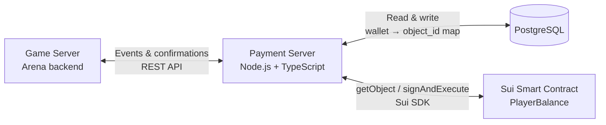
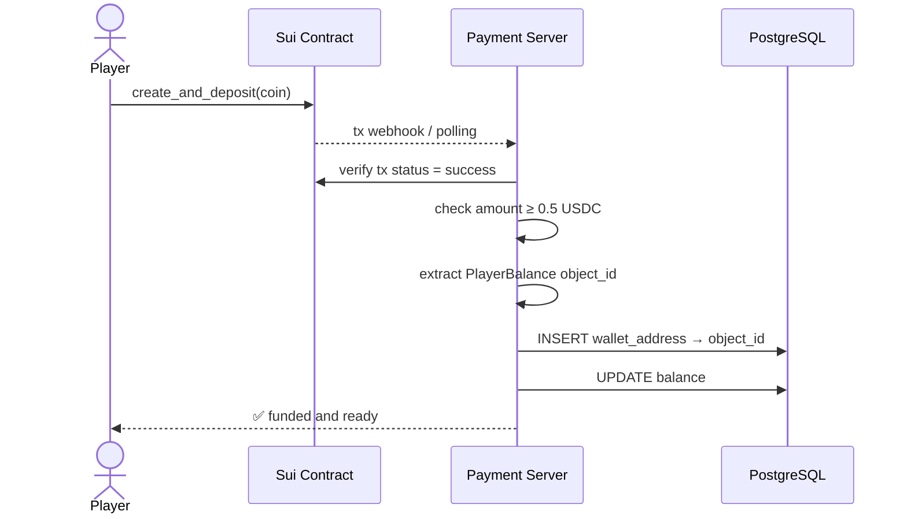
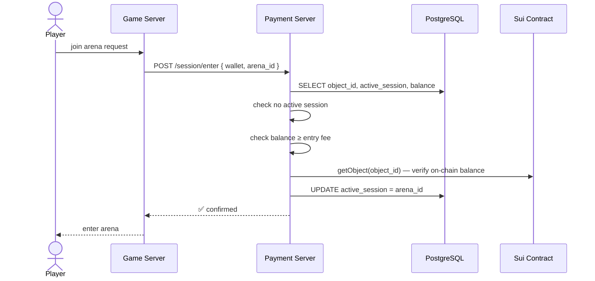
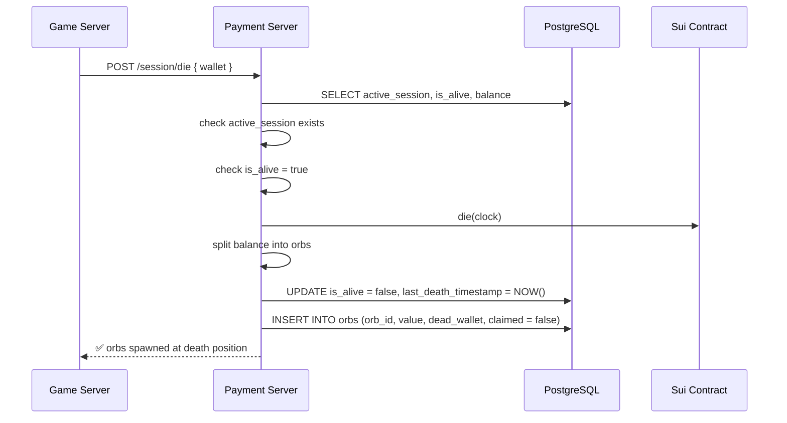
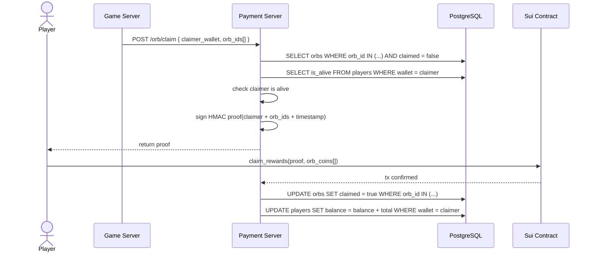
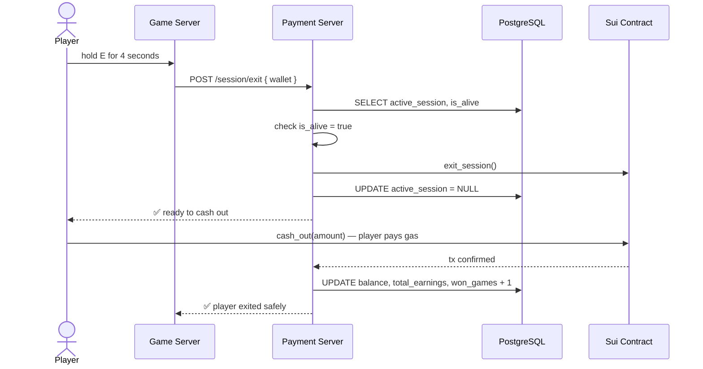
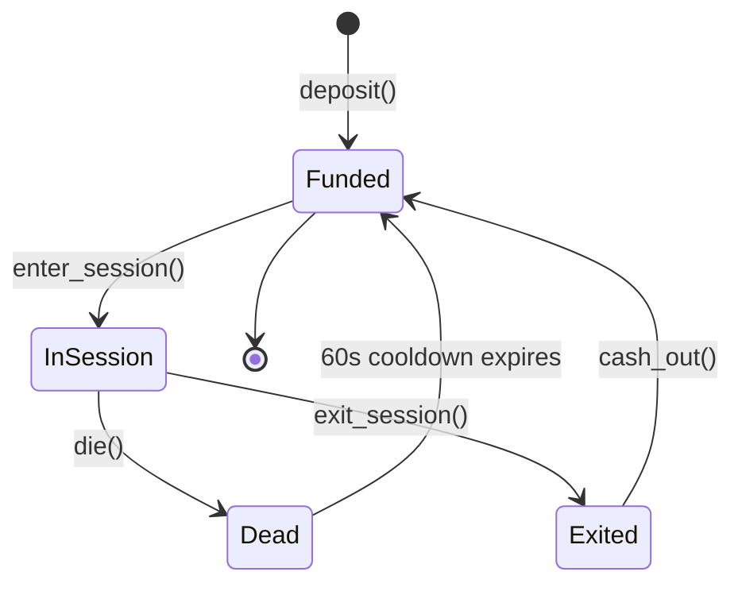

## Overview

The **Payment Server** is a dedicated Node.js + TypeScript service that sits between three systems: the Sui smart contract, PostgreSQL, and the Game Server. It never pays gas — it only validates, records, and triggers.



<Info>
  The Payment Server is the single source of truth for economic state. The Game Server handles physics and gameplay — it never touches the blockchain or the database directly.
</Info>

---

## Validation Flow by Event

### 1. Player deposit



```typescript
async function onDeposit(txDigest: string) {
  const tx = await suiClient.getTransactionBlock({ digest: txDigest });

  const objectId = extractPlayerBalanceId(tx);
  const amount   = extractDepositAmount(tx);

  if (amount < MIN_ENTRY_AMOUNT) throw new Error('Below minimum deposit');

  await db.query(`
    INSERT INTO players (wallet_address, object_id, balance)
    VALUES ($1, $2, $3)
    ON CONFLICT (wallet_address)
    DO UPDATE SET object_id = $2, balance = $3
  `, [tx.sender, objectId, amount]);
}
```

---

### 2. Arena entry



```typescript
async function validateEntry(wallet: string, arenaId: string) {
  const player = await db.query(
    'SELECT object_id, active_session, balance FROM players WHERE wallet_address = $1',
    [wallet]
  );

  if (player.active_session) throw new Error('Already in a session');
  if (player.balance < ENTRY_FEE) throw new Error('Insufficient balance');

  // Verify on-chain balance matches DB
  const obj = await suiClient.getObject({ id: player.object_id, options: { showContent: true } });
  const onChainBalance = extractBalance(obj);
  if (onChainBalance < ENTRY_FEE) throw new Error('On-chain balance mismatch');

  await db.query(
    'UPDATE players SET active_session = $1, is_alive = true WHERE wallet_address = $2',
    [arenaId, wallet]
  );
}
```

---

### 3. Player death & orb creation



```typescript
async function onPlayerDeath(wallet: string) {
  const player = await db.query(
    'SELECT object_id, active_session, balance FROM players WHERE wallet_address = $1',
    [wallet]
  );

  if (!player.active_session) throw new Error('Not in a session');

  const orbs = splitIntoOrbs(player.balance);

  await db.query(
    'UPDATE players SET is_alive = false, last_death_timestamp = NOW() WHERE wallet_address = $1',
    [wallet]
  );

  for (const orb of orbs) {
    await db.query(
      'INSERT INTO orbs (orb_id, dead_wallet, value, claimed) VALUES ($1, $2, $3, false)',
      [orb.id, wallet, orb.value]
    );
  }
}

function splitIntoOrbs(balance: number): Orb[] {
  const ORB_VALUE = 0.1;
  const count = Math.floor(balance / ORB_VALUE);
  return Array.from({ length: count }, (_, i) => ({
    id: crypto.randomUUID(),
    value: ORB_VALUE,
  }));
}
```

---

### 4. Orb claim



```typescript
async function validateOrbClaim(claimerWallet: string, orbIds: string[]) {
  const claimer = await db.query(
    'SELECT is_alive FROM players WHERE wallet_address = $1',
    [claimerWallet]
  );
  if (!claimer.is_alive) throw new Error('Dead players cannot claim orbs');

  const orbs = await db.query(
    'SELECT orb_id, value FROM orbs WHERE orb_id = ANY($1) AND claimed = false',
    [orbIds]
  );
  if (orbs.length !== orbIds.length) throw new Error('One or more orbs already claimed or not found');

  const proof = signProof({ claimerWallet, orbIds, timestamp: Date.now() });
  return { proof, orbs };
}

async function onClaimConfirmed(claimerWallet: string, orbIds: string[], totalValue: number) {
  await db.query(
    'UPDATE orbs SET claimed = true, claimed_by = $1, claimed_at = NOW() WHERE orb_id = ANY($2)',
    [claimerWallet, orbIds]
  );
  await db.query(
    'UPDATE players SET balance = balance + $1 WHERE wallet_address = $2',
    [totalValue, claimerWallet]
  );
}

function signProof(payload: object): string {
  return crypto
    .createHmac('sha256', process.env.PAYMENT_SERVER_SECRET!)
    .update(JSON.stringify(payload))
    .digest('hex');
}
```

<Warning>
  Mark orbs as `claimed = true` in PostgreSQL **only after** the on-chain tx is confirmed. If the tx fails and the orb is already marked claimed, the reward is permanently lost.
</Warning>

---

### 5. Session exit & cashout



```typescript
async function validateExit(wallet: string) {
  const player = await db.query(
    'SELECT active_session, is_alive FROM players WHERE wallet_address = $1',
    [wallet]
  );

  if (!player.active_session) throw new Error('No active session');
  if (!player.is_alive)       throw new Error('Dead players cannot exit — wait for cooldown');

  await db.query(
    'UPDATE players SET active_session = NULL WHERE wallet_address = $1',
    [wallet]
  );
}

async function onCashoutConfirmed(wallet: string, amount: number) {
  await db.query(`
    UPDATE players SET
      balance        = balance - $1,
      total_earnings = total_earnings + $1,
      won_games      = won_games + 1
    WHERE wallet_address = $2
  `, [amount, wallet]);
}
```

---

## Player state machine

Every player is always in one of these states. The Payment Server enforces valid transitions — invalid ones throw and are never forwarded to the contract.



| State | `active_session` | `is_alive` | Cashout allowed |
|---|---|---|---|
| `Funded` | `NULL` | `false` | ✅ Yes |
| `InSession` | `<arena_id>` | `true` | ❌ No |
| `Dead` | `<arena_id>` | `false` | ❌ No — 60s cooldown |
| `Exited` | `NULL` | `true` | ✅ Yes |

---

## API Endpoints

| Method | Endpoint | Called by | Description |
|---|---|---|---|
| `POST` | `/deposit/confirm` | Sui webhook | Confirms deposit tx, writes DB |
| `POST` | `/session/enter` | Game Server | Validates entry, locks session |
| `POST` | `/session/die` | Game Server | Marks death, creates orb rows in DB |
| `POST` | `/session/exit` | Game Server | Clears session lock |
| `POST` | `/orb/claim` | Game Server | Validates orbs, returns signed proof |
| `POST` | `/cashout/confirm` | Sui webhook | Updates balance + stats in DB |
| `GET` | `/player/:wallet/state` | Game Server | Returns player state + balance from DB |

---

## Security Rules

<CardGroup cols={2}>
  <Card title="Proof signing" icon="signature">
    Every `claim_rewards()` requires a backend-signed HMAC proof. Without it a player could fake orb claims and mint balance from nothing.
  </Card>
  <Card title="Double-claim prevention" icon="ban">
    Orbs are stored in PostgreSQL with a `claimed` boolean. Marked `true` only after on-chain tx confirmation. DB logs every claim for audit.
  </Card>
  <Card title="Session lock" icon="lock">
    `active_session` in PostgreSQL mirrors the on-chain state. Both layers must agree before cashout is allowed — the contract enforces this independently of the backend.
  </Card>
  <Card title="Death cooldown" icon="clock">
    60-second cooldown enforced both on-chain and in the Payment Server. Even if one layer fails, the other blocks the exploit.
  </Card>
</CardGroup>