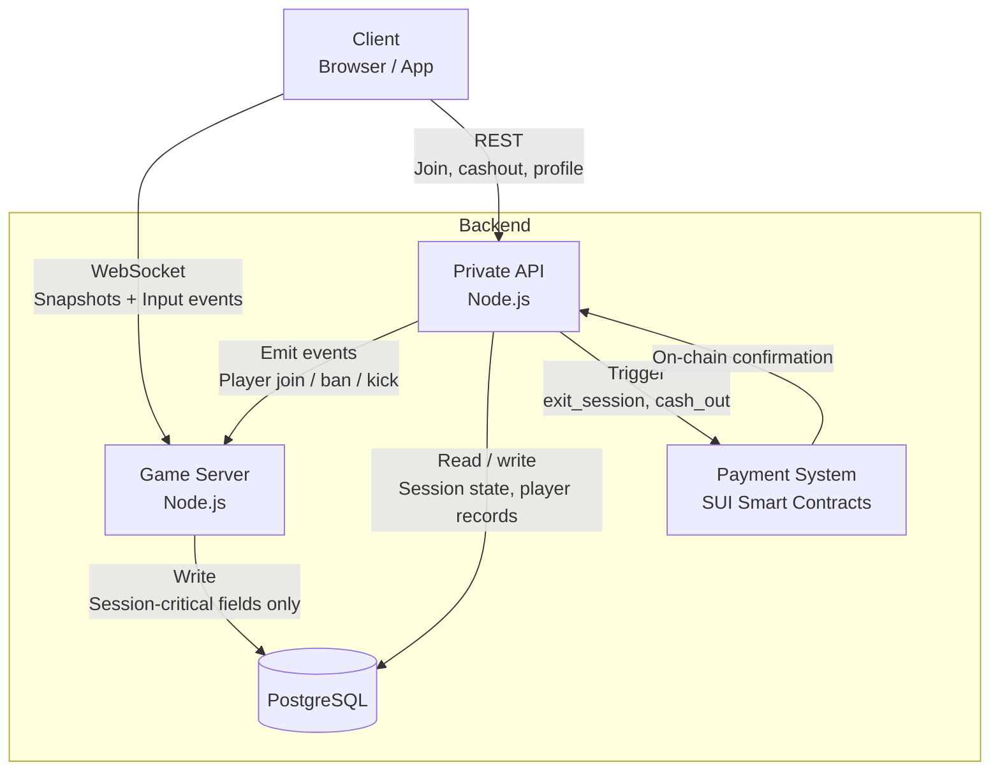
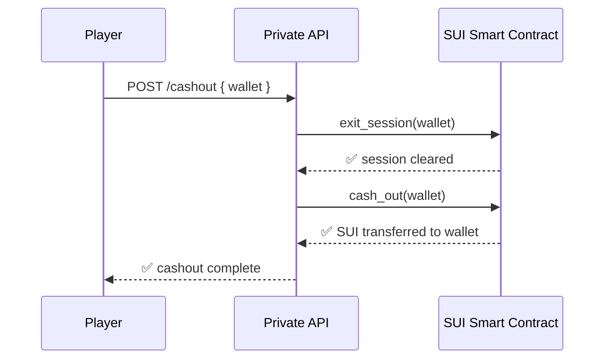
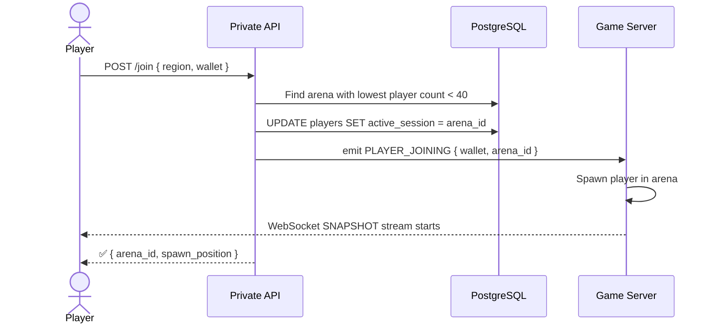
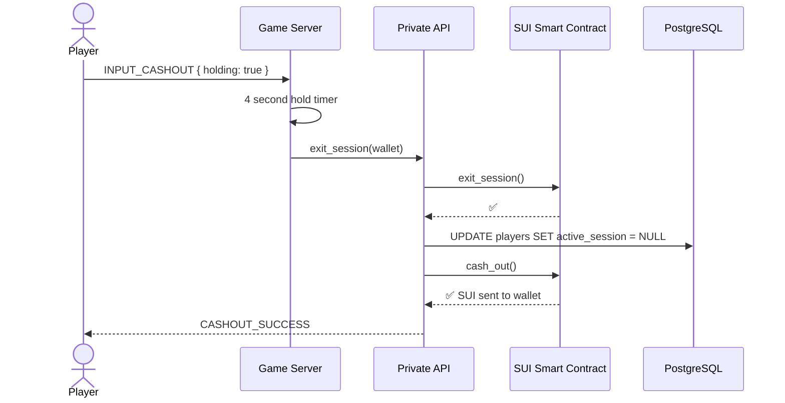

## Overview

The Serpentic backend is split into four distinct layers: the **Game Server**, the **Private API**, the **Payment System**, and the **Database**. Each layer has a clearly scoped responsibility — they communicate over internal channels, and only the Game Server and Private API are exposed to clients.

---

## Systems

### Game Server

The Game Server is the real-time core of Serpentic. It runs a fixed-rate tick loop per arena, processes player inputs, advances snake positions, checks collisions, and broadcasts the full arena state to all connected clients as JSON snapshots over WebSocket.

**Responsibilities:**
- Running the tick loop for every active arena instance
- Processing `INPUT_DIRECTION`, `INPUT_BOOST`, and `INPUT_CASHOUT` events
- Collision detection — border, body, food, orbs
- Broadcasting `SNAPSHOT` payloads to all clients in an arena
- Enforcing arena capacity and shard creation
- Applying admin events emitted by the Private API

**Key docs:**
- [Arenas](/infrastructure-and-solutions/game-server/rendering/arenas) — Instance lifecycle, matchmaking, and sharding
- [Input Processing](/infrastructure-and-solutions/game-server/rendering/input-processing) — Tick loop, movement, boost, collision pipeline
- [Snapshots](/infrastructure-and-solutions/game-server/rendering/snapshots) — Snapshot structure, broadcast flow, and event types
- [WebSocket](/infrastructure-and-solutions/game-server/communication/web-socket) — The connection layer between client and Game Server
- [Admin Commands](/infrastructure-and-solutions/game-server/rendering/admin-commands) — Privileged operations applied via the Private API

---

### Private API

The Private API is the REST layer that handles everything outside real-time gameplay — player authentication, arena assignment, admin operations, and triggering on-chain transactions. It is the only system that writes to the Payment System.

**Responsibilities:**
- Assigning players to arenas on join (`POST /join`)
- Serving and updating player profiles, stats, and skin preferences
- Routing admin commands to the Game Server
- Triggering `exit_session()` and `cash_out()` on the SUI smart contracts
- Writing audit logs for all admin actions
- Communicating with the Game Server via internal event emission

**Communication channels:**
- **Client → Private API** — REST over HTTPS
- **Private API → Game Server** — Internal event emission (e.g. `PLAYER_JOINING`, `PLAYER_BANNED`)
- **Private API → Payment System** — Smart contract calls on SUI

**Key docs:**
- [API](/infrastructure-and-solutions/game-server/communication/api) — Private API endpoints and internal communication
- [Admin Commands](/infrastructure-and-solutions/game-server/rendering/admin-commands) — Full admin endpoint reference

---

### Payment System

The Payment System is built on SUI smart contracts and handles all on-chain balance operations. The Private API is the only system that triggers contract calls — the Game Server never touches the payment layer directly.

**Responsibilities:**
- Holding player balances in the `PlayerBalance` smart contract
- Processing `cashin` (deposit) and `cash_out` (withdraw) transactions
- Running `exit_session()` to clear a session before cashout
- Validating payment state before allowing cashout

**Flow:**

**Key docs:**
- [Smart Contracts](/infrastructure-and-solutions/payment-system/smartcontracts) — How payments are rendered on-chain
- [Validation](/infrastructure-and-solutions/payment-system/validation) — How payment state is validated before cashout

---

### Database

PostgreSQL is the persistent store for all non-real-time state. The Game Server writes only session-critical fields per tick (`active_session`, `is_alive`, `balance`). The full arena state — positions, segments, orbs, food — lives exclusively in Game Server memory.

**What is persisted:**

| Table | Contents |
|---|---|
| `players` | Wallet, username, balance, stats, skins, session state, admin flags |
| `arenas` | Arena ID, region, capacity, status, timestamps |
| `payments` | Payment ID, player, amount, method, status, timestamps |
| `admin_log` | Every admin action — command, target, reason, issuing wallet, timestamp |

**Key docs:**
- [Tables & Relationships](/infrastructure-and-solutions/database/tables-and-relationships) — Full schema for all tables

---

### UI

The client UI is split into two contexts — the **main screen** (before joining an arena) and the **in-session overlay** (during active gameplay).

**Main screen panels:**
- Play button, server selector, balance panel, leaderboard, player stats, skin settings, profile, friend list, cashout / cashin panel, status bar

**In-session overlays:**
- Minimap, status bar (ping + FPS)

**Key docs:**
- [Interface](/infrastructure-and-solutions/UI/interface) — Full main screen reference
- [Minimap](/infrastructure-and-solutions/UI/minimap) — In-arena minimap overlay
- [Skins](/infrastructure-and-solutions/UI/skins) — Skin ownership, equipping, and rendering
- [Status](/infrastructure-and-solutions/UI/status) — Ping and FPS display

---

## Request flows

### Player joins an arena

### Player cashes out

---

## Where to go next

| I want to understand... | Go to |
|---|---|
| How arenas are created and managed | [Arenas](/infrastructure-and-solutions/game-server/rendering/arenas) |
| How player inputs become movement | [Input Processing](/infrastructure-and-solutions/game-server/rendering/input-processing) |
| How state gets from server to client | [Snapshots](/infrastructure-and-solutions/game-server/rendering/snapshots) |
| How the WebSocket connection works | [WebSocket](/infrastructure-and-solutions/game-server/communication/web-socket) |
| How payments and cashout work on-chain | [Smart Contracts](/infrastructure-and-solutions/payment-system/smartcontracts) |
| What admin commands are available | [Admin Commands](/infrastructure-and-solutions/game-server/rendering/admin-commands) |
| What the database schema looks like | [Tables & Relationships](/infrastructure-and-solutions/database/tables-and-relationships) |
| How the main UI is structured | [Interface](/infrastructure-and-solutions/UI/interface) |